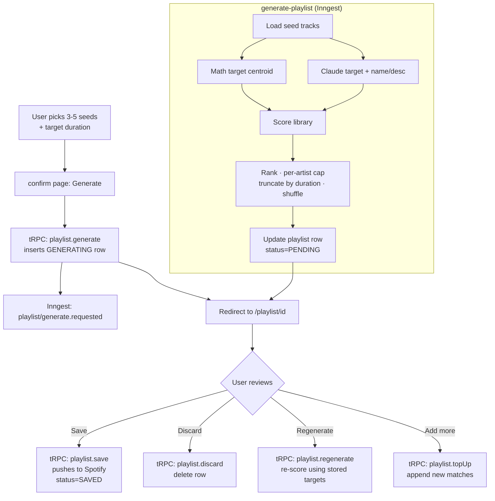

# Plan: Playlist Generation (Hybrid Claude + Math Scoring)

**Status:** Draft
**Created:** 2026-04-04

## Goal

Generate a vibe playlist from 3–5 seed songs plus an **optional free-text
vibe description** ("rainy Sunday coffee shop", "getting hyped for a
run"), targeting a user-specified **duration** (e.g. "about an hour").
Score every candidate track using **two independent target profiles**
— a Claude-generated semantic target (informed by seeds + the optional
user intent) and a math-based centroid of the seed tracks' own vibe
profiles — and **average the two scores** per candidate so tracks that
both methods agree on rank highest. Claude also produces the playlist's
display name and description.

Seeds are included in the output (they're the origin point of the vibe
and feel weird missing).

The playlist is first generated as a **preview** in the DB. The user sees
it on a playlist page and explicitly clicks **Save** to push it to Spotify
— no automatic push. The "recipe" for the playlist (seeds, Claude target,
math target, vibe name, target duration) is persisted alongside the tracks
so the user can later **regenerate** (re-score against their now-bigger
library, refreshing picks while keeping the vibe) or **top up** (add new
matches without disturbing the existing tracks).

A **dashboard view** lists all of the user's vibe tape playlists and
exposes view/regenerate/top-up/open-in-spotify per playlist.

## Rationale for the hybrid approach

Two different reasoning systems pick up different signals:

- **Claude semantic target** uses cultural knowledge. Given "Bohemian
  Rhapsody / Stairway to Heaven / November Rain", Claude can infer
  "epic 70s/80s rock ballads with dramatic structure" even if the seed
  tracks' literal vibe profiles don't fully capture the "epic ballad"
  descriptor. It picks up on things the enrichment pipeline has no
  visibility into (historical era, band narrative, lyrical themes).
- **Math centroid target** uses the enrichment data we just spent three
  PRs building. It's deterministic, fast, and grounded in the tracks'
  actual measured vibes. Math finds tracks that look similar "on paper"
  even when Claude might miss them.

**Averaging the two scores** (`(claudeScore + mathScore) / 2`) treats the
pair as an ensemble: a high average means **both** methods agree the
track matches the vibe, which is a stronger confidence signal than
either method alone. A track that only one method loves gets its score
halved, which is the right penalty — disagreement between the two signals
means lower confidence that the track actually fits.

(The earlier draft used `max()`, which rewards tracks that *either*
method endorses. That produces broader coverage but weaker cohesion.
Averaging is stricter and should produce playlists that feel tighter.
If the result feels too conservative in practice, we can swap
back to `max()` or to a weighted blend with a one-line change.)

## Architecture



## Playlist lifecycle

A playlist row moves through a small state machine:

| Status | Meaning |
|---|---|
| `GENERATING` | Row inserted by `playlist.generate`. The Inngest function is actively building the track list. UI shows a loading state. |
| `PENDING` | Inngest finished. Track list, name, description, targets populated but NOT pushed to Spotify. UI shows a preview with Save / Discard / Regenerate buttons. |
| `SAVED` | User clicked Save and Spotify push succeeded. `spotifyPlaylistId` is populated. Can still be regenerated or topped up from the dashboard — those operations update both the DB and the live Spotify playlist. |
| `FAILED` | Error during generation (Spotify token expired, Claude returned garbage, DB error). Row stays so the user can retry or discard. |

### Regenerate

**Input:** an existing `PENDING` or `SAVED` playlist ID.

**Behavior:** reuse the stored `claudeTarget`, `mathTarget`, `vibeName`,
`vibeDescription`, `seedSongIds`, `targetDurationMinutes` — **no new
Claude call**. Re-score the user's *current* library against the stored
targets, re-rank, re-cap, re-truncate by duration, re-shuffle. Replace
`generatedTrackIds` with the new list.

If the playlist is already `SAVED`, also replace the track list on the
live Spotify playlist (`PUT /v1/playlists/{id}/tracks` with the new URIs
— Spotify supports full replacement via PUT).

**Use case:** user's library has grown since the playlist was first
generated and they want fresh picks for the same vibe. Or the first
result missed and they want a re-roll against identical criteria.

**Regenerate does NOT touch:** vibe name, description, targets, or seeds.
It's a deterministic re-run against fresh data.

*(Optional "regenerate from scratch" variant that also re-calls Claude
and possibly produces a new name/targets — deferred past MVP.)*

### Top up

**Input:** an existing `PENDING` or `SAVED` playlist ID.

**Behavior:** reuse the stored targets. Score the user's library. **Filter
out tracks already in the playlist.** Take the top-ranked new matches
until the running duration (existing + new) hits the original
`targetDurationMinutes`. If the playlist is already at or above target,
add an amount equal to **25% of the original target** (with a 10-minute
floor so short playlists still get a meaningful top-up). This scales
uniformly: a 30-min playlist gets +10min, a 60-min playlist gets +15min,
a 4-hr playlist gets +60min. **Append** the new tracks to the existing
`generatedTrackIds` — existing order and tracks untouched.

If the playlist is `SAVED`, also append to the live Spotify playlist via
`POST /v1/playlists/{id}/tracks` (that endpoint appends by default).

**Use case:** library grew and user wants to add the new matches to an
existing playlist without disturbing what's already there.

**Top up does NOT touch:** vibe name, description, targets, seeds, OR the
existing track list. Purely additive.

## The two targets

### Target type

Both Claude and math produce the same shape — and that shape already
exists as `VibeProfile` in `src/lib/vibe-profile.ts`:

```ts
// Already defined in src/lib/vibe-profile.ts:
export type VibeProfile = {
  mood: CanonicalMood | null;
  energy: "low" | "medium" | "high" | null;
  danceability: "low" | "medium" | "high" | null;
  genres: string[];  // canonical forms from GENRE_VOCAB
  tags: string[];    // descriptors
};
```

**There is no separate `VibeTarget` type.** `playlist-scoring.ts`
imports `VibeProfile` from `vibe-profile.ts` and uses it as both the
candidate type (per-track) and the target type (Claude-generated or
math centroid). One type, one-way dependency, no risk of drift.

**Why it's safe to reuse:** Claude v2 guarantees mood is canonical or
null, and the rest of the vibe fields are directly populated by
`deriveVibeProfile` which produces `VibeProfile`-shape values. Every
row in the `track` table that has `vibe_updated_at IS NOT NULL` already
satisfies the `VibeProfile` contract — the repository just needs a
narrow cast when loading (`vibe_mood as CanonicalMood | null`).

The scoring function doesn't care where a `VibeProfile` came from —
both sides of the comparison are the same type.

### Math target (centroid of seeds)

Pure function `computeMathTarget(seeds: VibeProfile[]): VibeProfile`:

- **mood** — plurality winner across seed moods. Tie or all-null → `null`.
- **energy** — ordinal average. Map `low/medium/high → 0/1/2`, average,
  round, map back. Ignores nulls. All nulls → `null`.
- **danceability** — same as energy.
- **genres** — union of all seed genres, deduplicated, sorted by frequency
  DESC. Capped at 8 (same as `MAX_GENRES`).
- **tags** — union of all seed tags, deduplicated, sorted by frequency DESC.
  Capped at 12.

Lives in `src/lib/playlist-scoring.ts` as a pure function. Tested in
isolation.

### Claude target

New prompt file `src/lib/prompts/generate-playlist-criteria.ts`.

**Inputs to Claude:**
- Seed track list: `{name, artist, mood, energy, danceability, genres, tags}` for each
- **Optional user intent** — a free-text string (≤280 chars) describing
  the vibe the user is going for. When present, the prompt includes it
  as explicit guidance alongside the seeds. Examples: "rainy Sunday
  coffee shop", "getting hyped for a run", "late-night drive down an
  empty highway". When absent, the prompt omits the intent block
  entirely and works exactly like the seed-only version.
- The complete canonical vocabularies:
  - 11 moods via `CANONICAL_MOODS`
  - All ~75 genres via `GENRE_VOCAB` (joined into a comma-separated
    list at prompt-build time)
  - A handful of example tag descriptors (tags aren't constrained — we
    just show Claude the vibe of what a tag should look like)
- Request: produce a single target vibe profile + a short vibe name + a
  one-line description

**Resolving seed vs intent conflicts.** If the user picks 3 metal songs
as seeds but describes the vibe as "chill morning coffee", Claude has to
reconcile. The prompt **does not explicitly weight either side** — we
trust the LLM to pick a reasonable middle ground. The math target stays
decoupled from the intent (it's a pure centroid of the seed profiles),
so conflicts are naturally moderated by the averaged scoring: tracks
that only the Claude-side "chill morning" interpretation endorses get
their score halved by the metal-centroid math target, and the playlist
ends up centered on the intersection — chill tracks with metal
sensibilities, or vice versa. The hybrid design does the right thing
without prompt gymnastics.

**Why the full genre vocab?** Extra ~600 tokens on Haiku is rounding
error at personal-use scale, and it eliminates ambiguity: Claude picks
from the explicit list instead of improvising, so the output is
guaranteed in-vocab (no silent drops, no rejected generations, no
normalizer for creative-spelling misses).

**Prompt build pattern:**
```ts
import { GENRE_VOCAB } from "@/lib/vibe-profile";
import { CANONICAL_MOODS } from "@/lib/prompts/classify-tracks";

const GENRE_LIST = Array.from(GENRE_VOCAB).sort().join(", ");
const MOOD_LIST = CANONICAL_MOODS.join(", ");

// Prompt string references ${GENRE_LIST} and ${MOOD_LIST} so the vocab
// and the prompt stay in sync automatically — add a genre to
// GENRE_VOCAB and the next generation picks it up with no second edit.
```

**Prerequisite:** `GENRE_VOCAB` is currently a file-local `const` in
`vibe-profile.ts`. PR B should export it alongside the other vibe
profile primitives.

**Expected output (JSON):**
```json
{
  "target": {
    "mood": "uplifting",
    "energy": "high",
    "danceability": "high",
    "genres": ["hip-hop", "pop", "funk"],
    "tags": ["summer", "driving", "catchy"]
  },
  "vibeName": "Summer Shotgun",
  "vibeDescription": "Windows-down anthems you scream along to."
}
```

Validated with the same pattern as `isValidClassification` in
`sync-library.ts`:

- `target.mood` is canonical or null (via the shared
  `normalizeClaudeMood` helper)
- `target.energy` / `target.danceability` are `"low" | "medium" | "high"`
  or null
- `target.genres` / `target.tags` are arrays of non-empty strings
- `vibeName` is a non-empty string, max 60 characters (the
  playlist-name-ish limit — Spotify truncates longer names on display)
- `vibeDescription` is a non-empty string, **max 120 characters**
  (intent: one line on the playlist card; Spotify's hard cap is 300
  but we want tighter for display). The prompt explicitly asks Claude
  to keep it "under 120 characters, one sentence" so rejections are rare

Any field outside these constraints → the whole response is rejected
and Inngest retries.

**`normalizeClaudeMood` extracted to a shared module.** The existing
helper is file-local in `sync-library.ts:45-54`. As the first step of
PR B, move it to `src/lib/prompts/canonical-mood.ts` as an exported
function, update `sync-library.ts` to import from the new location
(behavior-preserving refactor), then have the new playlist validator
import from the same module. One source of truth for mood
normalization; no copy-paste drift when we add a third caller.

`CANONICAL_MOODS` and `CanonicalMood` stay in `classify-tracks.ts` as
the source of truth for the vocabulary itself — the new
`canonical-mood.ts` module imports from there. Callers that need both
the vocab and the normalizer do two imports; fine at the cost of a
cleaner dependency graph.

Uses Claude Haiku (same model as classification) — fast, cheap, good
enough for this. Single call per playlist generation.

## Scoring function

`src/lib/playlist-scoring.ts` imports `VibeProfile` from
`@/lib/vibe-profile` and uses it for both arguments:

```ts
import type { VibeProfile } from "@/lib/vibe-profile";

export function scoreTrack(
  candidate: VibeProfile,
  target: VibeProfile
): number
```

(Dependency direction: `playlist-scoring.ts` → `vibe-profile.ts`. No
cycle. `vibe-profile.ts` only imports from `classify-tracks.ts` for the
`CanonicalMood` source of truth.)

Returns a number in `[0, 1]`. Weighted sum of component similarities:

| Component | Weight | Similarity metric |
|---|---|---|
| mood | 0.30 | exact match → 1.0, else 0.0. Either side null → 0.0 |
| energy | 0.15 | exact → 1.0, one level off → 0.5, two levels → 0.0, null → 0.0 |
| danceability | 0.15 | same as energy |
| genres | 0.30 | Jaccard similarity: `|A ∩ B| / |A ∪ B|`. Empty both → 0.0 |
| tags | 0.10 | Jaccard similarity |

Weights sum to 1.0. Starting values — tune from real output.

**Final per-track score — average of the two methods:**
```ts
const claudeScore = scoreTrack(candidate, claudeTarget);
const mathScore = scoreTrack(candidate, mathTarget);
const finalScore = (claudeScore + mathScore) / 2;
```

Tracks both methods agree on rank highest. Tracks that only one method
endorses get halved, which is the right penalty — disagreement = low
confidence.

Store `claudeScore`, `mathScore`, and `finalScore` on each candidate so
we can audit post-hoc which method contributed what, and so tuning
weights or swapping back to `max()` later doesn't require re-running
Claude.

**Degenerate-target fallback.** If Claude's target comes back with all-
null fields and empty arrays (the rare edge case where Claude couldn't
produce useful criteria), `claudeScore` will be ~0 for every candidate
and halving it would torpedo every track's score. Detect this up front:
if `claudeTarget` is effectively empty, fall back to `finalScore =
mathScore` only (and log it). Same logic in reverse if math target is
degenerate (all seeds had null enrichment — very unlikely given the
library is fully populated).

### Why Jaccard for arrays?

It rewards overlap while penalizing bloat. A candidate with one
matching genre out of its eight doesn't outrank a candidate with three
matches out of four. `|intersection| / |union|` captures both recall
(how much the target is covered) and precision (how tightly the
candidate matches).

## Ranking and filtering

Given all scored candidates:

1. **Include seeds in the candidate pool.** Seeds are the origin point
   of the vibe and they should appear in the playlist — leaving them out
   feels weird. They'll rank near the top naturally (they match the
   centroid closely because they *are* the centroid) and the window
   shuffle mixes them into the final order alongside other high-scoring
   tracks.
2. **Sort by `finalScore` descending.**
3. **Apply a dynamic per-artist cap.** Caps the number of tracks any
   single artist can contribute, scaled to the target playlist length
   so the cap stays at roughly 15–20% regardless of size. Formula:

   ```ts
   const estimatedTrackCount = Math.ceil(targetDurationMinutes * 60 / 210);
   const perArtistCap = Math.max(3, Math.ceil(estimatedTrackCount / 6));
   ```

   (210 seconds ≈ average track length across typical libraries.)
   Common cases:
   - 30 min → ~9 tracks → cap **3**
   - 60 min → ~17 tracks → cap **3**
   - 90 min → ~26 tracks → cap **5**
   - 2 hrs → ~34 tracks → cap **6**
   - 4 hrs → ~69 tracks → cap **12**

   A fixed cap of 10 (earlier draft) would have let one artist take
   59% of a 60-minute playlist — it only bit for very long playlists.
   The dynamic formula catches the "seeded a 3-song Taylor Swift vibe,
   got 10 Taylor Swift tracks in a 17-track playlist" case at typical
   sizes while still allowing meaningful concentration for long
   playlists where a single artist can reasonably carry more weight.

   Implementation: the Inngest function computes the cap from
   `targetDurationMinutes` and passes it to `rankAndFilter` as
   `perArtistCap`. The function itself stays dumb about the formula.
4. **Truncate by duration, not track count.** The user passes a target
   duration (in minutes) when they generate. Walk the ranked-and-capped
   list, summing each track's `durationMs` from
   `track_spotify_enrichment`, and stop as soon as the running total
   crosses the target. The last track added might push the total a bit
   over — that's fine, the plan is "about an hour", not exactly an hour.
   Default target is 60 minutes if the user doesn't specify.
5. **Shuffle within sliding windows of 8.** After truncation we have an
   ordered list where position 1 is the strongest average-score match
   and the last position is the weakest. Pure-rank order listens weird
   (front-loaded, peters out). Fisher-Yates shuffle within sliding
   windows of 8 mixes adjacent tracks without letting a low-ranked track
   jump to the front — the strongest matches stay in the first third of
   the playlist, but you don't necessarily hear #1 first. Window size is
   tunable; 8 is the starting value.

**Seeds are hard-guaranteed to appear in the output.** The user
explicitly picked them; it would be weird and silent if one got evicted
by score math or the per-artist cap. They're pre-inserted into `picked`
before the ranked walk runs — see `requiredTrackIds` in the
`rankAndFilter` contract below. They still count toward the duration
budget and the per-artist cap for subsequent tracks, but required
tracks themselves are exempt from the cap (if you pick 4 Metallica
songs as seeds on a playlist with cap 3, you get all 4 anyway — your
explicit choice beats the heuristic).

The window shuffle then distributes seeds through the playlist
alongside the rest of the top-ranked tracks.

### `rankAndFilter` contract

All five ranking steps live in a single function. **There is no separate
`pickByDuration`** — top-up calls `rankAndFilter` with an `excludeIds`
set and an adjusted target duration.

```ts
// src/lib/playlist-scoring.ts

export type ScoredTrack = {
  trackId: string;
  primaryArtistId: string;
  durationMs: number;
  claudeScore: number;
  mathScore: number;
  finalScore: number;
};

// Hard cap on playlist length — Spotify's PUT /playlists/{id}/tracks
// body is limited to 100 URIs, and we use that endpoint to sync
// regenerate results back to the live playlist. Going over 100 would
// require a multi-batch PUT + append sequence that's not atomic; if a
// partial batch fails the Spotify playlist ends up in a half-replaced
// state. Simpler to just refuse playlists > 100 tracks. At the 60-minute
// default this never bites — you'd need to request a ~5.5 hour playlist
// to hit it.
export const MAX_PLAYLIST_TRACKS = 100;

export type RankAndFilterOptions = {
  targetDurationMs: number;
  perArtistCap: number;
  shuffleWindowSize: number;
  // Optional: track IDs that MUST appear in the output regardless of
  // score or per-artist cap. Used by generate/regenerate to guarantee
  // seed tracks are always in the playlist. Order is preserved in the
  // pre-shuffle `picked` list. These tracks still count toward the
  // duration budget.
  requiredTrackIds?: readonly string[];
  // Optional: track IDs to skip (top-up passes existing playlist tracks
  // so they don't get picked again).
  excludeIds?: ReadonlySet<string>;
  // Optional: starting per-artist counts (top-up pre-populates from
  // existing tracks so the cap applies across existing + new).
  initialArtistCounts?: ReadonlyMap<string, number>;
};

export function rankAndFilter(
  candidates: ScoredTrack[],
  options: RankAndFilterOptions,
): ScoredTrack[];
```

**Algorithm (six steps, in order):**

1. **Seed `picked` with required tracks.** For each ID in
   `requiredTrackIds` (in order), find the matching candidate and
   prepend it to `picked`. Increment `artistCounts[primaryArtistId]`
   for each — but required tracks themselves are **exempt from the
   cap check**. This guarantees user-selected seeds always appear, even
   if two seeds share an artist and the dynamic cap would otherwise
   block the second. The required tracks' `durationMs` is added to the
   running duration total.
2. **Sort non-required candidates** by `finalScore DESC`, ties broken
   by `trackId` ASC for determinism.
3. **Filter + cap** — walk the sorted list. Skip any track whose
   `trackId ∈ excludeIds`. Skip any track whose `trackId` is already in
   `picked` (i.e. was a required track). Skip any track whose
   `primaryArtistId` has already hit `perArtistCap` in the map (this
   check fires for non-required tracks, and uses the post-required
   counts from step 1). Otherwise append to `picked` and increment its
   artist's count.
4. **Truncate by duration** — stop walking the moment the running
   duration total (`picked.reduce((sum, t) => sum + t.durationMs, 0)`)
   reaches or exceeds `options.targetDurationMs`. The last track added
   may push the total slightly over target — accepted. **Also stop if
   `picked.length` reaches `MAX_PLAYLIST_TRACKS` (100)** — this is the
   Spotify atomic-sync cap, not a design preference. Log a warning if
   this branch fires so we know the duration target was too ambitious
   for the library. Note: if required tracks alone already exceed the
   target, `picked` still contains all of them — required tracks are
   never truncated.
5. **Shuffle windows** — Fisher-Yates shuffle within non-overlapping
   sliding windows of `shuffleWindowSize`. Windows are
   `[0..size-1]`, `[size..2*size-1]`, … Last window may be smaller
   than `shuffleWindowSize` — shuffle it anyway. Required tracks are
   subject to normal shuffle — they don't get special positional
   treatment beyond being in `picked` at all.
6. **Return** the shuffled list.

**Invariant for tests:** "A track originally at sorted position `P`
lands in final position `[floor(P / windowSize) * windowSize,
floor(P / windowSize) * windowSize + windowSize - 1]`." Plain English:
tracks never jump outside their window. A rank-20 track with window
size 8 is in window 2 (positions 16–23), so after shuffle it can land
anywhere in 16–23 but never in 0–15 or 24+.

**Duration math lives in the caller.** Generate passes
`targetDurationMs = targetDurationMinutes * 60_000` directly. Top-up
computes its own `targetDurationMs` (current playlist duration + extra
to fill the target, or +N minutes if already at target — see the
"Top up" lifecycle section for details) and passes it in alongside
`excludeIds` and `initialArtistCounts`.

## Schema additions

The existing `Playlist` model has `vibeName`, `vibeDescription`,
`seedSongIds`, `spotifyPlaylistId`. Need to add:

```prisma
enum PlaylistStatus {
  GENERATING
  PENDING
  SAVED
  FAILED
}

model Playlist {
  // ... existing fields ...
  status                PlaylistStatus @default(GENERATING)
  generatedTrackIds     String[] @map("generated_track_ids")     // ordered
  targetDurationMinutes Int      @map("target_duration_minutes") // reused on regen/top-up
  userIntent            String?  @map("user_intent")             // optional free-text vibe description (≤280 chars)
  claudeTarget          Json?    @map("claude_target")           // full recipe, reused on regen/top-up
  mathTarget            Json?    @map("math_target")             // same
  errorMessage          String?  @map("error_message")           // populated when status=FAILED
  // ... existing fields ...
}
```

**Why `targetDurationMinutes` + targets are persisted:** they're the
"recipe" for regeneration and top-up. Without them we'd have to re-run
Claude every time the user wants to refresh picks, and the resulting
playlist might drift into a different vibe on each run. Storing the
recipe means regenerate/top-up are deterministic refreshes of the same
vibe against the current library.

`generatedTrackIds` is the final ordered list of Track IDs (internal
cuid2s, not Spotify IDs).

**`status` ↔ `spotifyPlaylistId` invariant.** `status === "SAVED"` if
and only if `spotifyPlaylistId !== null`. These two fields are
technically redundant — `SAVED` could be derived from
`spotifyPlaylistId IS NOT NULL` — but keeping both as explicit columns
makes queries, UI branching, and eyeball debugging simpler. The
invariant is enforced in exactly one place: `playlistRepository.markSaved`
is the only method that sets either field, and it sets both atomically
in the same UPDATE. No other repository method touches `status` when it
touches `spotifyPlaylistId` or vice versa. A 4-state enum for ~10
lifetime playlists is fine; the clarity wins over the storage purity.

**No playlist_track join table for MVP.** Keep it simple. If we later
want "which playlists contain track X" queries, we can migrate.

## tRPC router

`src/server/routers/playlist.router.ts` (new):

### `playlist.generate`

```ts
generate({
  seedTrackIds: string[];            // 3-5
  targetDurationMinutes?: number;    // default 60
  userIntent?: string;               // optional free-text, ≤280 chars
}) → { playlistId: string }
```

- Validates seed count (3–5) and seed track ownership
- Validates `targetDurationMinutes` (15–240 if provided)
- Validates `userIntent` if provided: non-empty after trim, ≤280
  characters. Empty/whitespace-only strings are normalized to
  `undefined` so the row stores `null` rather than `""`
- Inserts a placeholder playlist row with `status: GENERATING`,
  `vibeName: "Generating..."`, the target duration, and the user intent
- Fires `playlist/generate.requested` Inngest event
- Returns `{ playlistId }` so the client can redirect to
  `/playlist/{id}` and poll for `status: PENDING`

### `playlist.save`

```ts
save({ playlistId: string }) → { spotifyPlaylistId: string }
```

- Validates playlist ownership and `status === "PENDING"`
- Loads the generated tracks, fetches their Spotify URIs
- `POST /v1/me/playlists` to create the Spotify playlist
- `POST /v1/playlists/{id}/tracks` to populate (≤100 tracks enforced
  by `MAX_PLAYLIST_TRACKS`, so a single POST is always enough)
- Updates the DB row: `spotifyPlaylistId`, `status: "SAVED"`
- Runs inline in the mutation, not via Inngest — it's one-shot and the
  user is waiting

**Partial-failure behavior (accepted tradeoff).** If step 3 (create
playlist) succeeds but step 4 (add tracks) fails — network blip, rate
limit, token expires between calls — the user ends up with an **empty
orphan playlist in Spotify** plus a DB row still at `PENDING`. On retry
the user gets a *second* empty Spotify playlist (and the successful
one populated) because the mutation always calls create.

This is fine for personal use at single-digit playlists lifetime.
Orphans clear out of Spotify via manual delete in the Spotify UI if
they ever become annoying. We are **not** adding orphan-tracking
columns, recovery logic, or automatic Spotify deletion — the
complexity isn't worth it at this scale.

If the failure rate becomes noticeable, revisit with one of:
- track the orphan `spotifyPlaylistId` on the DB row and reuse it on
  retry (skip create, go straight to append)
- wrap in try/catch and issue `DELETE /v1/playlists/{id}/followers`
  (Spotify's "unfollow" = delete from your library) on failure

### `playlist.discard`

```ts
discard({ playlistId: string }) → { ok: true }
```

- Validates ownership
- Allowed in any status except `SAVED` (deleting a saved playlist is a
  separate flow — if we even build it)
- Deletes the DB row. Does NOT delete the Spotify playlist if one
  somehow exists (should never happen pre-save, but defensive).

### `playlist.regenerate`

```ts
regenerate({ playlistId: string }) → { playlistId: string }
```

- Validates ownership and `status IN (PENDING, SAVED)`
- Fires `playlist/regenerate.requested` Inngest event — the function
  loads the stored targets, re-scores the user's current library,
  rebuilds `generatedTrackIds`, and (if the playlist is `SAVED`) pushes
  the new list to the live Spotify playlist via `PUT /v1/playlists/{id}/tracks`
- Returns `{ playlistId }` so the UI can navigate/poll

### `playlist.topUp`

```ts
topUp({ playlistId: string }) → { playlistId: string }
```

- Same validation as regenerate
- Fires `playlist/top-up.requested` Inngest event — the function loads
  stored targets, scores the library, filters out current tracks,
  appends new matches until the duration target is re-hit (or adds 25%
  of the original target, min 10min, if already at target), and (if
  `SAVED`) appends to the live Spotify playlist via
  `POST /v1/playlists/{id}/tracks`

### `playlist.getById`

```ts
getById({ id: string }) → Playlist with resolved track details
```

Used by the `/playlist/{id}` page. Returns the full playlist row plus
the resolved `Track` rows for `generatedTrackIds` in order.

**Stuck-GENERATING TTL override.** If the `onFailure` handler itself
fails (DB down mid-transition, etc.), a playlist row can be stuck at
`GENERATING` forever. `getById` applies a read-layer override:

```ts
const STUCK_GENERATING_MS = 5 * 60_000;
if (
  row.status === "GENERATING" &&
  row.createdAt.getTime() < Date.now() - STUCK_GENERATING_MS
) {
  row.status = "FAILED";
  row.errorMessage ??= "Generation timed out";
}
```

No write happens — the DB row keeps its stale `GENERATING` status —
but the client sees `FAILED` and the polling loop naturally stops.
Clicking Retry / Discard sweeps the stale row via the normal
regenerate / delete paths. Five minutes is generous; realistic
generation takes 3–6 seconds.

### `playlist.listByUser`

```ts
listByUser() → Playlist[] (summary, newest first)
```

Used by the dashboard to list the user's vibe tape playlists. Returns
playlists ordered by `createdAt DESC`, with just the fields the list
view needs (id, vibe name, description, status, track count, created_at,
spotifyPlaylistId).

## Inngest functions

Three separate Inngest functions. Each handles one lifecycle operation.
No Spotify push in any of them — Spotify writes happen either in the
`playlist.save` tRPC mutation (first save) or at the end of regenerate /
top-up for `SAVED` playlists (via a dedicated step inside the function).

### Shared helper: `scoreLibrary`

Generate, regenerate, and top-up all need to "load the user's library and
score every track against a pair of targets". Extracted into a shared
helper so the scoring math can't drift across the three functions:

```ts
// src/inngest/helpers/score-library.ts

import { scoreTrack, type ScoredTrack } from "@/lib/playlist-scoring";
import type { VibeProfile } from "@/lib/vibe-profile";
import { trackRepository } from "@/repositories/track.repository";

export async function scoreLibrary(
  userId: string,
  targets: { claude: VibeProfile; math: VibeProfile },
): Promise<ScoredTrack[]> {
  const library =
    await trackRepository.findAllWithScoringFieldsByUser(userId);

  return library.map((t) => {
    const claudeScore = scoreTrack(t, targets.claude);
    const mathScore = scoreTrack(t, targets.math);
    return {
      trackId: t.id,
      primaryArtistId: t.primaryArtistId,
      durationMs: t.durationMs ?? 0,
      claudeScore,
      mathScore,
      finalScore: (claudeScore + mathScore) / 2,
    };
  });
}
```

**What the helper does NOT do:** rank, cap, filter, exclude, shuffle,
or write to the DB. Each Inngest function wraps the `scoreLibrary` call
in its own `step.run("score-library", ...)` and then calls
`rankAndFilter` with its own options (`requiredTrackIds` for generate/
regenerate, `excludeIds` + `initialArtistCounts` for top-up).

**Why this split:** `scoreLibrary` is the part that's identical across
all three functions. `rankAndFilter` is parameterized differently per
function. Extracting the shared half gives us "scoring math cannot
drift between operations" without over-coupling the parts that should
differ.

**Top-up simplification:** the current top-up sketch has an in-memory
`.filter((t) => !existingIds.has(t.id))` step before scoring. With
`scoreLibrary` shared, top-up scores all tracks including the already-
present ones and relies on `rankAndFilter`'s `excludeIds` to drop them
during ranking. Scoring is pure math on ~1,500 tracks — the redundant
work is negligible and the code is simpler.

### Concurrency rules (all three functions)

All three use the **same concurrency key and limit**:

```ts
concurrency: [{ key: "event.data.playlistId", limit: 1 }]
```

Keying on `playlistId` (rather than `userId`) gets the right behavior
for each operation:

- **Generate** — every generate call creates a fresh playlist row via
  tRPC before firing the event, so every event has a unique
  `playlistId`. Two concurrent generates from the same user on
  different seeds run in parallel (different keys, neither blocked).
- **Regenerate / top-up** — two browser tabs hitting Regenerate on the
  same playlist share a `playlistId`, so the second blocks on the first
  and Inngest serializes them. No clobber race.

### Double-click prevention for Generate

The per-playlistId concurrency key doesn't help with a user rapidly
double-clicking the Generate button — each click creates a *different*
playlist row. That's a UI concern, handled at the button layer:

- The confirm page disables the Generate button the moment the
  `playlist.generate` mutation starts, and keeps it disabled until the
  mutation resolves (success or error). React Query's `isPending` flag
  on the mutation covers this without extra state management.
- On success, the page redirects to `/playlist/[id]` — the button is
  gone anyway. On error, the button re-enables so the user can retry.

### `generate-playlist`

`src/inngest/functions/generate-playlist.ts`:

```ts
export const generatePlaylist = inngest.createFunction(
  {
    id: "generate-playlist",
    retries: 3,
    concurrency: [{ key: "event.data.playlistId", limit: 1 }],
    triggers: [{ event: "playlist/generate.requested" }],
    onFailure: async ({ event }) => {
      const playlistId = event.data.event.data.playlistId;
      if (typeof playlistId === "string") {
        await playlistRepository.setFailed(playlistId, "generation failed");
      }
    },
  },
  async ({ event, step }) => {
    const {
      userId,
      playlistId,
      seedTrackIds,
      targetDurationMinutes = 60,
      userIntent,  // optional free-text, already validated/normalized by tRPC
    } = event.data;

    // 1. Load seeds (scoring-field shape — includes primaryArtistId + durationMs)
    const seeds = await step.run("load-seeds", async () => {
      return trackRepository.findByIdsWithScoringFields(seedTrackIds);
    });

    // 2. Math target (pure centroid of seeds — userIntent doesn't apply here)
    const mathTarget = await step.run("compute-math-target", async () => {
      return computeMathTarget(seeds);
    });

    // 3. Claude target + name/description (userIntent enriches the prompt if present)
    const { claudeTarget, vibeName, vibeDescription } = await step.run(
      "claude-target",
      async () => {
        const prompt = buildPlaylistCriteriaPrompt(seeds, userIntent);
        const response = await generatePlaylistCriteria(prompt);
        return response; // validated, throws on bad shape
      }
    );

    // 4. Score library via shared helper (seeds included as candidates)
    const scored = await step.run("score-library", async () => {
      return scoreLibrary(userId, {
        claude: claudeTarget,
        math: mathTarget,
      });
    });

    // 5. Rank, cap, truncate by duration, shuffle.
    //    Seeds are required — hard-guaranteed to appear in the output.
    const perArtistCap = computePerArtistCap(targetDurationMinutes);
    const final = rankAndFilter(scored, {
      targetDurationMs: targetDurationMinutes * 60_000,
      perArtistCap,
      shuffleWindowSize: 8,
      requiredTrackIds: seedTrackIds,
    });

    // 6. Write playlist row → status: PENDING
    await step.run("save-playlist", async () => {
      await playlistRepository.completeGeneration(playlistId, {
        vibeName,
        vibeDescription,
        generatedTrackIds: final.map((s) => s.trackId),
        claudeTarget,
        mathTarget,
        status: "PENDING",
      });
    });

    return { playlistId, trackCount: final.length };
  }
);
```

No Spotify push. The playlist sits at `PENDING` until the user explicitly
clicks Save (which fires `playlist.save` via tRPC, handled inline).

### `regenerate-playlist`

`src/inngest/functions/regenerate-playlist.ts`:

Shape is similar but simpler — steps 1 and 3 (Claude) are skipped.

```ts
async ({ event, step }) => {
  const { playlistId } = event.data;

  const playlist = await step.run("load-playlist", async () => {
    return playlistRepository.findByIdWithRecipe(playlistId);
  });
  // playlist has: userId, seedSongIds, claudeTarget, mathTarget,
  // targetDurationMinutes, status, spotifyPlaylistId

  const scored = await step.run("score-library", async () => {
    return scoreLibrary(playlist.userId, {
      claude: playlist.claudeTarget,
      math: playlist.mathTarget,
    });
  });
  const perArtistCap = computePerArtistCap(playlist.targetDurationMinutes);
  const final = rankAndFilter(scored, {
    targetDurationMs: playlist.targetDurationMinutes * 60_000,
    perArtistCap,
    shuffleWindowSize: 8,
    // Regenerate reuses the stored seed IDs — seeds stay hard-guaranteed
    // on every re-roll, matching the original generation's guarantee.
    requiredTrackIds: playlist.seedSongIds,
  });

  await step.run("save-playlist", async () => {
    await playlistRepository.updateTracks(playlistId, final.map((s) => s.trackId));
  });

  // If already on Spotify, replace the live track list
  if (playlist.status === "SAVED" && playlist.spotifyPlaylistId) {
    await step.run("sync-spotify", async () => {
      const token = await getValidToken(playlist.userId);
      if (!token) throw new Error("No Spotify token");
      const tracks = await trackRepository.findByIds(final.map((s) => s.trackId));
      const uris = tracks.map((t) => `spotify:track:${t.spotifyId}`);
      await replacePlaylistTracks(token.accessToken, playlist.spotifyPlaylistId, uris);
    });
  }

  return { playlistId };
}
```

### `top-up-playlist`

`src/inngest/functions/top-up-playlist.ts`:

```ts
async ({ event, step }) => {
  const { playlistId } = event.data;

  const playlist = await step.run("load-playlist", async () => {
    return playlistRepository.findByIdWithRecipe(playlistId);
  });

  const existingIds = new Set(playlist.generatedTrackIds);
  const existingDurationMs = /* sum of current tracks' durationMs */;

  // Score library via shared helper — no pre-filter here, rankAndFilter
  // drops existing tracks via excludeIds below.
  const scored = await step.run("score-library", async () => {
    return scoreLibrary(playlist.userId, {
      claude: playlist.claudeTarget,
      math: playlist.mathTarget,
    });
  });

  // Compute how much more duration to add.
  //
  // If the playlist is below target, fill back to target.
  // If it's at or above target, add 25% of the original target (with a
  //   10-minute floor so short playlists still get a meaningful amount).
  // This scales uniformly across playlist sizes — a 30-min playlist
  // doesn't double when topped up, and a 4hr playlist doesn't grow by a
  // trivial 30min.
  const targetMs = playlist.targetDurationMinutes * 60_000;
  const topUpFloorMs = 10 * 60_000;
  const topUpIncrementMs = Math.max(Math.ceil(targetMs / 4), topUpFloorMs);
  const extraMs = Math.max(targetMs - existingDurationMs, topUpIncrementMs);

  // Pre-populate per-artist counts from existing tracks so the cap
  // applies across existing + new.
  const initialArtistCounts = buildArtistCountsFromExisting(
    playlist.generatedTrackIds
  );

  // rankAndFilter with excludeIds + initialArtistCounts — same function
  // the generate flow uses, just with different inputs. Cap is computed
  // from the ORIGINAL target duration so top-up honors the same overall
  // shape as the original generation.
  const perArtistCap = computePerArtistCap(playlist.targetDurationMinutes);
  const additions = rankAndFilter(scored, {
    targetDurationMs: extraMs,
    perArtistCap,
    shuffleWindowSize: 8,
    excludeIds: existingIds,
    initialArtistCounts,
  });

  await step.run("append-tracks", async () => {
    await playlistRepository.appendTracks(
      playlistId,
      additions.map((s) => s.trackId)
    );
  });

  if (playlist.status === "SAVED" && playlist.spotifyPlaylistId) {
    await step.run("append-to-spotify", async () => {
      /* POST /v1/playlists/{id}/tracks — appends */
    });
  }

  return { playlistId, added: additions.length };
}
```

## Repository changes

> **PR C status:** implemented on `feat/playlist-pr-c-schema-repositories`.
> The sketch below was the design; the code is now the source of truth.
> Two intentional drifts from this sketch landed in PR C:
> (1) `TrackWithDisplayFields` exposes `artistsDisplay: string` — a
> `string_agg` of **all** artists in `track_artist.position` order —
> instead of `primaryArtistName`, so "feat." artists are preserved
> for rendering; (2) `PlaylistStatus` is imported from `@/db/enums`,
> not `@/db/types` (prisma-kysely emits value+type from the enums file).

### New domain types

Two new types in `src/domain/song.ts`, both extending the base `Track`:

```ts
// For the scoring pipeline — needs vibe fields (already on Track),
// primary artist (for per-artist cap), and duration (for truncation).
export type TrackWithScoringFields = Track & {
  primaryArtistId: string;
  durationMs: number | null;
};

// For UI display — needs artist name alongside the rest of the track
// row. Avoids N+1 artist lookups when rendering a playlist.
export type TrackWithDisplayFields = Track & {
  primaryArtistName: string;
};
```

Both types narrow cast the vibe fields from DB strings to
`VibeProfile`-compatible types at the repository layer — safe because
every populated `vibe_mood` in the DB is guaranteed canonical by the
Claude v2 prompt.

### Updated `Playlist` domain type

The existing `src/domain/playlist.ts` grows to cover the new columns.
Crucially, `claudeTarget` and `mathTarget` are narrowed from their DB
shape (`Json?` in Prisma / `JsonValue` in Kysely) to `VibeProfile | null`
at the domain layer so consumers never see `unknown`:

```ts
import type { VibeProfile } from "@/lib/vibe-profile";
import type { PlaylistStatus } from "@/db/types"; // generated from Prisma enum

export type Playlist = {
  id: string;
  userId: string;
  spotifyPlaylistId: string | null;
  vibeName: string;
  vibeDescription: string | null;
  seedSongIds: string[];
  status: PlaylistStatus;
  generatedTrackIds: string[];
  targetDurationMinutes: number;
  userIntent: string | null;
  claudeTarget: VibeProfile | null;
  mathTarget: VibeProfile | null;
  errorMessage: string | null;
  artImageUrl: string | null;
  lastSyncedAt: Date | null;
  createdAt: Date;
  updatedAt: Date;
};
```

The narrow cast lives in exactly one place: `playlistRepository` when
it reads rows from Kysely, via
`row.claudeTarget as VibeProfile | null`. Trusted because the only
writers (`completeGeneration` and the mathTarget-equivalent path) both
serialize values that are already typed as `VibeProfile` in their
caller. No `any` / `unknown` leaks past the repo boundary.

### `trackRepository`

- **`findByIdsWithScoringFields(ids): Promise<TrackWithScoringFields[]>`**
  — loads the seed tracks for the scoring pipeline. Returns vibe fields
  + `primaryArtistId` + `durationMs`. Single query joining `track` +
  `track_artist WHERE position = 0` + `track_spotify_enrichment`.
- **`findAllWithScoringFieldsByUser(userId): Promise<TrackWithScoringFields[]>`**
  — returns every track in the user's liked library in scoring shape.
  Single query joining `track` + `liked_song` + `track_artist WHERE
  position = 0` + `track_spotify_enrichment`. Used by all three Inngest
  functions (generate, regenerate, top-up).
- **`findByIdsWithDisplayFields(ids): Promise<TrackWithDisplayFields[]>`**
  — loads tracks for UI rendering. Includes the primary artist name via
  `string_agg` (matching the existing `findByUserId` pattern at
  `track.repository.ts:22-40`). Used by the playlist detail page to
  render seeds and generated tracks.

Note: the old plan names (`findByIdsWithVibe`, `findAllWithVibeByUser`)
are replaced by the scoring-fields variants above. `findByIdsWithVibe`
is not added separately — if a caller only needs vibe fields, it can
use `findByIdsWithScoringFields` and ignore the extra fields, or read
directly from `track` if performance ever matters.

### `playlistRepository` (new file — `src/repositories/playlist.repository.ts`)

- **`createPlaceholder(userId, { seedTrackIds, targetDurationMinutes, userIntent })`**
  — inserts a row with `status: GENERATING`, `vibeName: "Generating..."`,
  empty `generatedTrackIds`, and the optional `userIntent` (null if not
  provided). Returns the new playlist ID.
- **`completeGeneration(playlistId, data)`** — called at the end of the
  `generate-playlist` Inngest function. Sets vibe name, description,
  targets, generated track IDs, and `status: PENDING`.
- **`updateTracks(playlistId, trackIds)`** — full replacement of
  `generatedTrackIds`. Used by `regenerate-playlist`.
- **`appendTracks(playlistId, trackIds)`** — pushes new IDs onto the end
  of the existing array. Used by `top-up-playlist`.
- **`markSaved(playlistId, spotifyPlaylistId)`** — sets
  `spotifyPlaylistId` and `status: SAVED`. Called inline by `playlist.save`.
- **`setFailed(playlistId, errorMessage)`** — sets `status: FAILED` and
  the error message. Called by `onFailure` handlers.
- **`delete(playlistId)`** — hard delete. Used by `playlist.discard`.
- **`findByIdWithRecipe(playlistId)`** — returns the full row including
  targets, seeds, target duration, status, spotifyPlaylistId. Used by
  regenerate/top-up functions.
- **`findByIdWithTracks(playlistId)`** — returns the playlist plus the
  resolved `Track` rows for `generatedTrackIds` in order. Used by the
  `/playlist/{id}` page.
- **`findAllByUserSummary(userId)`** — list view for the dashboard.
  Returns id, vibe name, description, status, track count, created_at,
  spotifyPlaylistId, ordered by `createdAt DESC`. Does NOT resolve
  tracks. Track count uses a raw SQL snippet —
  `` sql<number>`array_length(generated_track_ids, 1)`.as("trackCount") `` —
  following the `string_agg` pattern at `track.repository.ts:31`. Don't
  fetch the `generatedTrackIds` array and count it in JS; that pulls
  N\*K IDs over the wire for no reason.

## Spotify API client additions

`src/lib/spotify.ts`:

- **`createPlaylist(token, { name, description, public })`** — `POST
  /v1/me/playlists`. Creates a playlist for the authenticated user.
- **`addTracksToPlaylist(token, playlistId, uris)`** — `POST
  /v1/playlists/{id}/tracks`. Appends to the end of the playlist. Used
  on first save AND on top-up. Spotify caps the body at 100 URIs per
  call — since `rankAndFilter` enforces `MAX_PLAYLIST_TRACKS = 100` up
  front, a single POST is always enough for save, and top-up appends
  are guaranteed to stay ≤100 total playlist length (we reject
  generating past 100 at the scoring layer). The implementation still
  batches at 100 URIs per request defensively, so raising
  `MAX_PLAYLIST_TRACKS` later does not require touching this helper.
  No-ops on an empty `uris` array.
- **`replacePlaylistTracks(token, playlistId, uris)`** — `PUT
  /v1/playlists/{id}/tracks` with the full list. Wipes and replaces the
  track list atomically in a single call. Used by regenerate when the
  playlist was already `SAVED`. Since the playlist is guaranteed ≤100
  tracks by `MAX_PLAYLIST_TRACKS`, this is always a single PUT —
  **there is no multi-batch path**, which eliminates the partial-state
  failure mode (if a single PUT fails, Inngest retries the whole step
  and the replacement is idempotent).

All three go through the existing `spotifyFetch` helper.

**Limitation noted here for visibility:** Vibe tape playlists are
hard-capped at 100 tracks. Rationale lives in the comment above
`MAX_PLAYLIST_TRACKS` in `src/lib/playlist-scoring.ts`. If we ever need
longer playlists, we'd have to switch to a non-atomic multi-batch sync
path with explicit rollback handling — deferred until someone actually
asks for a 6+ hour playlist.

## UI changes

### Confirm page (`create/confirm`)

- Add a **duration picker** — preset buttons (30min / 1hr / 90min / 2hr)
  plus an optional freeform input. Default 60 minutes.
- Add an **optional vibe description textarea** — "Tell us the vibe
  you're going for (optional)", placeholder
  `e.g. rainy Sunday coffee shop, or getting hyped for a run`. Max 280
  characters, shows a live character counter. Empty/whitespace-only is
  treated as "not provided" and doesn't send a `userIntent` param.
- Add a **Generate playlist** button that fires `playlist.generate` with
  the selected seeds, duration, and (if non-empty) user intent. Disabled
  during the in-flight mutation. Redirects to `/playlist/{id}` on
  success.

### Playlist detail page (new: `app/(app)/playlist/[id]/page.tsx`)

Driven by a tRPC query polling `playlist.getById` while status is
`GENERATING` (every 1s via React Query `refetchInterval`, stops once
status flips to `PENDING` / `SAVED` / `FAILED`). 1s gives the user
near-instant feedback when generation completes — realistic generate
time is ~3–6 seconds (Claude Haiku call dominates), so 1s polling
means ≤1s lag between completion and UI update. At personal-use scale
against localhost the per-request cost is rounding error.

**Layout per status:**

- **`GENERATING`** — vibe name placeholder, spinner, "Claude is picking
  tracks…" message. Polling.
- **`PENDING`** — full preview:
  - Vibe name, description
  - If `userIntent` is set, a subtle "You said: '…'" line above the
    vibe name so the user can see what they asked for reflected back
  - Seed tracks with album art (pulled from the `seedSongIds` array)
  - Track list with album art, artist, title
  - Three buttons: **Save to Spotify** (fires `playlist.save`),
    **Regenerate** (fires `playlist.regenerate`, returns to
    `GENERATING`), **Discard** (fires `playlist.discard`, redirects to
    dashboard)
- **`SAVED`** — same as PENDING but:
  - Save button replaced with **Open in Spotify** (deep link using
    `spotifyPlaylistId`)
  - **Regenerate** and **Add more** buttons visible
  - A small "Synced to Spotify" indicator
- **`FAILED`** — error message, **Retry** button (fires generate again
  with the same seeds), **Discard** button

### Dashboard (`app/(app)/dashboard`)

Add a **Your Vibe Tapes** section that calls `playlist.listByUser` and
renders a grid/list of playlist cards:

- Vibe name + one-line description
- Track count, creation date
- Status badge (`PENDING` / `SAVED` / `FAILED`)
- Click → `/playlist/{id}`
- Quick-action menu: **Regenerate**, **Add more**, **Open in Spotify**
  (the last only when `SAVED`), **Discard**

Empty state: "You haven't generated any vibe tapes yet. [Create one]".

### Polling + invalidation strategy

React Query with `refetchInterval` on the `playlist.getById` query while
`status === "GENERATING"`, disabled otherwise. `playlist.regenerate` /
`playlist.topUp` mutations invalidate the query on success so the user
sees the new state immediately (and polling resumes because status flips
back to `GENERATING`). `playlist.listByUser` is invalidated after any
mutation so the dashboard stays fresh.

**Polling timeout (belt-and-suspenders for stuck generation).** Even
though `getById` applies a read-layer TTL override that flips stuck
`GENERATING` rows to `FAILED` after 5 minutes, the UI also caps its
polling with a hard stop. A `pollCount` ref increments on each
`refetch`; once it exceeds `MAX_POLLS = 120` (120 × 1s = 120 seconds,
20× the realistic generation time), the detail page switches to a
"taking longer than expected" state with a **Refresh** button that
re-runs the query manually. The two mechanisms reinforce each other:
the server-side TTL unsticks the logical status, the client-side
polling cap unsticks the UI even if the TTL ever misfires.

## Phases (PR splits)

- **PR A — Scoring pure function + math target.** ✅ Shipped.
  `src/lib/playlist-scoring.ts` with `computeMathTarget`, `scoreTrack`,
  `rankAndFilter`, and `MAX_PLAYLIST_TRACKS = 100`. Pure, tested in
  isolation at `tests/lib/playlist-scoring.test.ts`. No DB, no Inngest,
  no tRPC.
- **PR B — Claude target prompt + validation.** ✅ Shipped.
  Extracted `normalizeClaudeMood` from `sync-library.ts` into
  `src/lib/prompts/canonical-mood.ts` (behavior-preserving) and
  exported `GENRE_VOCAB` from `src/lib/vibe-profile.ts`. Added
  `src/lib/prompts/generate-playlist-criteria.ts` with the prompt
  builder (full mood + genre vocabs inlined, optional user intent)
  and a strict response validator with length caps. Added
  `generatePlaylistCriteria` wrapper in `src/lib/claude.ts`,
  refactored to share a private `parseJsonFromClaude` helper with
  `classifyTracks`. Tests at `tests/lib/prompts/canonical-mood.test.ts`
  and `tests/lib/prompts/generate-playlist-criteria.test.ts`. No
  schema, Inngest, tRPC, or UI yet.
- **PR C — Schema + repositories.** Implemented on branch
  `feat/playlist-pr-c-schema-repositories` (not yet merged). Prisma
  migration adds the `PlaylistStatus` enum (`GENERATING` / `PENDING` /
  `SAVED` / `FAILED`) and the recipe columns (`generatedTrackIds`,
  `targetDurationMinutes`, `userIntent`, `claudeTarget`, `mathTarget`,
  `errorMessage`) on `playlist`. Domain adds `TrackWithScoringFields`
  and `TrackWithDisplayFields` as the two shapes the downstream PRs
  will consume. `trackRepository` gains `findByIdsWithScoringFields`,
  `findAllWithScoringFieldsByUser` (candidate-pool loader for the
  Inngest functions), and `findByIdsWithDisplayFields` (UI shape, uses
  `string_agg` to collapse all artists in `track_artist.position`
  order). `playlistRepository` is rewritten with full CRUD plus
  lifecycle methods (`createPlaceholder`, `completeGeneration`,
  `updateTracks`, `appendTracks`, `markSaved`, `setFailed`, `delete`,
  `findByIdWithRecipe`, `findByIdWithTracks`, `findAllByUserSummary`);
  `markSaved` is the **sole writer** of the
  `status ↔ spotifyPlaylistId` invariant. `findAllByUserSummary`
  returns a lightweight `PlaylistSummary` and uses PG `array_length`
  so the dashboard listing doesn't pull every `generatedTrackIds`
  array over the wire. Tests in
  `tests/repositories/playlist.repository.test.ts` and
  `tests/repositories/track.repository.test.ts`; `tests/helpers/mock-db.ts`
  gains `set` / `values` spies so repo tests can assert UPDATE/INSERT
  payloads.
- **PR D — Spotify API client for playlist ops.** ✅ Shipped on
  `feat/playlist-pr-d-spotify-client`. `createPlaylist`,
  `addTracksToPlaylist`, `replacePlaylistTracks` added to
  `src/lib/spotify.ts`; the internal `spotifyFetch` helper now accepts
  an optional `{ method, body }` so the same rate-limit/retry path
  covers POST/PUT writes. One drift from the sketch below:
  `addTracksToPlaylist` defensively batches at 100 URIs per request via
  `chunk()` even though `MAX_PLAYLIST_TRACKS = 100` means a single POST
  is sufficient today — cheap insurance if the cap is ever relaxed.
  Tests in `tests/lib/spotify.test.ts` mock `global.fetch` and cover
  URL/body/headers, the empty-URI no-op, >100 URI batching, and the
  replace path.
- **PR E — Generate Inngest function + `playlist.generate` tRPC.** Just
  the first-run flow, ending at `PENDING`. No save/regen/top-up yet.
- **PR F — Save/discard flow.** `playlist.save` (inline tRPC) and
  `playlist.discard`. Playlist detail page in PENDING state with Save/
  Discard/Regenerate buttons. Shipping this gets the user from seeds to
  a live Spotify playlist end-to-end.
- **PR G — Regenerate + top-up Inngest functions + tRPC mutations.**
  Extends the detail page with regenerate/top-up actions for `SAVED`
  playlists. Also handles the Spotify sync via
  `replacePlaylistTracks` / `addTracksToPlaylist`.
- **PR H — Dashboard list view.** `playlist.listByUser` + UI. Depends
  on F/G being shipped so the list has interesting statuses and actions
  to render.

Seven PRs total. A, B, C, D are independent small PRs that unblock E.
E gets the core generate flow working but sitting at PENDING. F closes
the loop end-to-end. G and H extend lifecycle + discovery.

If any of these feel too fine-grained during implementation, bundle
adjacent ones (e.g., C+D, or F+G).

## Tests

### PR A (scoring)
- `computeMathTarget`: all-same seeds → that profile; mixed moods with a
  plurality → winner; tied moods → null; ordinal energy averaging;
  genre/tag frequency sorting and capping.
- `scoreTrack`: exact match → 1.0; no match → 0.0; partial genre overlap
  → expected Jaccard; null handling on both sides.
- **Average blending**: when both `claudeScore` and `mathScore` are
  non-zero, `finalScore` is their average. Degenerate-target fallback:
  if claudeTarget is empty (all null/empty arrays), `finalScore` falls
  back to `mathScore` only.
- `rankAndFilter`: per-artist cap respected (with and without
  `initialArtistCounts`); `excludeIds` skips listed tracks; duration
  truncation stops at/just-past target; `MAX_PLAYLIST_TRACKS = 100`
  hard cap fires when the duration target demands more than 100 tracks;
  shuffle never moves a track outside its window (track at sorted
  position `P` lands in `[floor(P/W)*W, floor(P/W)*W + W - 1]`).
- `requiredTrackIds` guarantees: every ID in the list appears in the
  output, even if the track's score would otherwise be filtered; even
  if its artist is over the cap; even if the duration target would be
  exceeded by required tracks alone. Required tracks are counted toward
  duration + artist counts but bypass the cap check themselves.
- Regression test for the "3 Metallica seeds with cap 3" case: all 3
  seeds appear, no non-seed Metallica track appears (cap is exhausted
  by the seeds themselves).

### PR B (Claude prompt)
- Prompt text includes the full canonical mood list (11) and the full
  genre vocabulary (via `GENRE_VOCAB`), plus the expected JSON shape.
- `normalizeClaudeMood` extraction: shared module exports the function;
  `sync-library.ts` imports from the new location; behavior is
  byte-identical to the old file-local copy (regression tests for
  case/whitespace normalization still pass).
- Validator happy path: canonical target + short vibe name + short
  description passes.
- Validator rejects: off-list mood, bad energy/danceability, non-array
  genres/tags, malformed JSON, missing fields.
- Validator rejects: `vibeName` over 60 characters.
- Validator rejects: `vibeDescription` over 120 characters.
- Validator accepts: `vibeDescription` at exactly 120 characters
  (boundary test).
- **`buildPlaylistCriteriaPrompt(seeds, undefined)`** produces a prompt
  with no user-intent block — snapshot matches the seed-only baseline.
- **`buildPlaylistCriteriaPrompt(seeds, "rainy morning")`** produces a
  prompt that includes the user's exact intent string verbatim.
- **`buildPlaylistCriteriaPrompt(seeds, "")`** treats the empty string
  as absent (same as `undefined`) — no intent block in the prompt.

### PR C (repo)
- `findByIdsWithScoringFields` returns scoring-field shape; empty input
  → empty array.
- `findAllWithScoringFieldsByUser` joins correctly; includes
  `primaryArtistId` + `durationMs`.
- `findByIdsWithDisplayFields` includes `primaryArtistName` via the
  `string_agg` pattern.
- `playlistRepository` CRUD: placeholder insert, update generated,
  set Spotify ID, find by ID with track resolution.

### PR D (Spotify client)
- `createPlaylist` hits the right URL with the right body, returns the
  playlist ID from the response.
- `addTracksToPlaylist` batches at 100 tracks per call.

### PR E (Generate Inngest function + `playlist.generate` tRPC)
- Step sequence matches the design (load-seeds → math-target →
  claude-target → score-library → save-playlist).
- Seed validation: 3–5 IDs, all owned by the calling user, duration
  within 15–240 minutes.
- `userIntent` validation: accepted when ≤280 characters; normalized to
  `null` when empty/whitespace-only; rejected when over 280.
- `userIntent` threads through: tRPC → event data → `createPlaceholder`
  (persisted on the row) → Inngest function (passed to
  `buildPlaylistCriteriaPrompt`).
- `playlist.generate` inserts a placeholder row with
  `status: GENERATING` before firing the Inngest event.
- End of generate flips status: `GENERATING → PENDING` with all recipe
  fields populated (vibeName, vibeDescription, claudeTarget, mathTarget,
  generatedTrackIds, targetDurationMinutes).
- `onFailure` handler transitions `GENERATING → FAILED` and writes
  `errorMessage`.
- Concurrency: two events with different `playlistId`s run in parallel;
  two with the same `playlistId` serialize.

### PR F (Save / discard + detail page)
- `playlist.save` validates `status === "PENDING"` and rejects anything
  else.
- `playlist.save` happy path: creates Spotify playlist, appends tracks,
  flips status `PENDING → SAVED`, sets `spotifyPlaylistId`.
- `playlist.save` partial-failure path: if `addTracksToPlaylist` throws
  after `createPlaylist` succeeds, the row stays at `PENDING` and the
  error propagates to the caller. Orphan Spotify playlist behavior
  is the accepted tradeoff (see tRPC router section).
- `status` / `spotifyPlaylistId` invariant: `markSaved` is the only
  repo method that touches either field, and it sets both atomically.
- `playlist.discard` deletes the DB row for any status except `SAVED`.
- Detail page: polls while `status === "GENERATING"`, stops polling on
  any other status.
- Detail page: renders correct buttons per status (PENDING shows
  Save/Discard/Regenerate, SAVED shows Open in Spotify/Regenerate/Add
  more, FAILED shows Retry/Discard, GENERATING shows spinner).
- Generate button on confirm page disables during mutation (React
  Query `isPending`) to prevent double-click.

### PR G (Regenerate + top-up Inngest functions + tRPC mutations)

**Load-bearing lifecycle invariants:**

- **Regenerate preserves the recipe.** After `playlist.regenerate`
  completes, these fields are unchanged vs. pre-call: `vibeName`,
  `vibeDescription`, `claudeTarget`, `mathTarget`, `seedSongIds`,
  `targetDurationMinutes`. Only `generatedTrackIds` differs.
- **Regenerate re-runs seeds as `requiredTrackIds`.** All seed IDs
  appear in the re-generated `generatedTrackIds`, even if a re-scored
  seed now ranks lower than some non-seed track.
- **Top-up preserves existing tracks.** After `playlist.topUp` completes,
  the first `N` elements of `generatedTrackIds` (where `N` is the
  pre-top-up length) are byte-identical to the pre-top-up list. Only
  the suffix changes.
- **Top-up per-artist cap across existing + new.** If the existing
  playlist has 3 tracks by Artist X and the dynamic cap is 3, top-up
  adds zero new Artist X tracks. Verified by pre-populating
  `initialArtistCounts` and checking `rankAndFilter` honors the
  starting map.
- **Top-up increment formula.** A 30-min playlist at 30min tops up by
  10min (floor). A 60-min at 60min tops up by 15min. A 4hr at 4hr
  tops up by 60min. Below-target case fills to target.

**Status transitions:**

- `SAVED → GENERATING → SAVED` via regenerate (playlist was already
  pushed to Spotify).
- `PENDING → GENERATING → PENDING` via regenerate (playlist was never
  pushed).
- Same transitions for top-up.
- Regenerate/top-up on a `GENERATING` or `FAILED` playlist → rejected
  by tRPC validation.

**Spotify sync:**

- Regenerate on a `SAVED` playlist calls `replacePlaylistTracks` with
  the new URI list.
- Top-up on a `SAVED` playlist calls `addTracksToPlaylist` with only
  the new URIs (not the full list).
- Regenerate/top-up on a `PENDING` playlist does not touch Spotify.

**Concurrency:**

- Two regenerates on the same `playlistId` serialize (second waits for
  first); two on different IDs run in parallel.

### PR H (Dashboard list view)
- `playlist.listByUser` returns all playlists for the current user,
  newest first, with summary fields only.
- Empty-state: user with zero playlists sees the "generate your first
  vibe tape" CTA.
- Each card renders the correct status badge.
- Quick-action menu items are correct per status (Open in Spotify only
  shown when `SAVED`).
- Dashboard query re-fetches after any mutation (invalidation via
  React Query).

## Open questions resolved during design

- **Should seeds appear in the playlist?** Yes — they're included in the
  candidate pool and flow through ranking naturally. The window shuffle
  mixes them with other high-scoring tracks. If they cluster too much at
  the front in practice, we can add an even-spacing pass later.
- **Should the user be able to tell Claude what vibe they're going for?**
  Yes — optional free-text field (≤280 chars) on the confirm page. When
  present, the prompt includes it as explicit guidance alongside the
  seeds; when absent, the prompt omits the intent block and works as
  before. The math target is unchanged either way (pure seed centroid)
  so conflicts between user intent and seed acoustics are naturally
  moderated by the averaged scoring. Persisted on the playlist row for
  display and potential future re-use.
- **Blend or max the two scores?** Average. `(claudeScore + mathScore) /
  2` enforces agreement between the two methods — a track both love
  ranks highest, a track only one loves gets halved. Degenerate-target
  fallback uses the non-degenerate method's score alone.
- **Per-artist cap value.** Dynamic: `max(3, ceil(estimatedTrackCount / 6))`
  where `estimatedTrackCount = ceil(targetDurationMinutes * 60 / 210)`.
  This keeps the cap at roughly 15–20% of the playlist regardless of
  length — strict enough to catch seed-artist domination at short
  playlists, permissive enough to allow meaningful concentration at long
  ones. See "Ranking and filtering" step 3 for the full table.
- **Playlist size.** Duration-based, not count-based. Default 60 minutes,
  configurable per generation via `targetDurationMinutes`. Walk the
  ranked list summing `durationMs` until the total crosses the target.
- **Shuffle window size.** 8. Preserves coarse rank order, mixes
  adjacent tracks.
- **Auto-push to Spotify?** No. The playlist is generated as a `PENDING`
  preview, the user reviews it on the detail page, and an explicit
  **Save** button (`playlist.save` tRPC mutation) pushes it to Spotify
  and flips the status to `SAVED`. See the Playlist lifecycle section
  for the full state machine.
- **Private or public Spotify playlists?** Private for MVP.
- **What if Claude's target is degenerate?** Fall back to math score
  only (`finalScore = mathScore`). See "Degenerate-target fallback"
  under Scoring function.

## Open questions to resolve before PR A

- **What happens if a user has fewer matching tracks than their target
  duration?** Return what we have, don't pad with low-score tracks.
  A 60-minute target from a 200-song library might realistically produce
  a 40-minute playlist. Acceptable.
- **Vibe description length.** One line (~80 chars) feels right for
  the Spotify description field and for display. Enforce in the
  validator.
- **Score weights** (mood 0.30, energy 0.15, dance 0.15, genres 0.30,
  tags 0.10). Need to be tuned against real output. Lock the starting
  values, generate 10–20 playlists, adjust.
- **UI affordance for target duration.** Dropdown with presets (30/60/90/120
  minutes)? Slider? Free-form number input? Deferred to PR F review.

## Prerequisites

- **Seed picker UI (item #3 on the roadmap)** needs to be finished so a
  user can actually pick 3-5 seeds before hitting Generate. Status is
  `[~]` — need to check what's left. Doesn't block the backend work
  (PRs A–E can ship without the picker being done); only PR F
  (UI integration) depends on it.

## Verification

After all PRs ship:

1. Pick 3-5 seed songs from the library
2. Click Generate, watch Inngest dashboard — confirm all steps run
3. Land on `/playlist/{id}` — see vibe name, description, track list
4. Click through to Spotify — playlist should exist and be playable
5. DB spot-check:
   ```sql
   SELECT vibe_name, vibe_description, array_length(generated_track_ids, 1) AS size
   FROM playlist ORDER BY created_at DESC LIMIT 5;
   ```
6. Sanity check: generate 5 playlists from different seed combos, eyeball
   the cohesion. Is Claude picking up vibes the math misses? Are math
   picks weird or are they reasonable? Tune weights from here.
