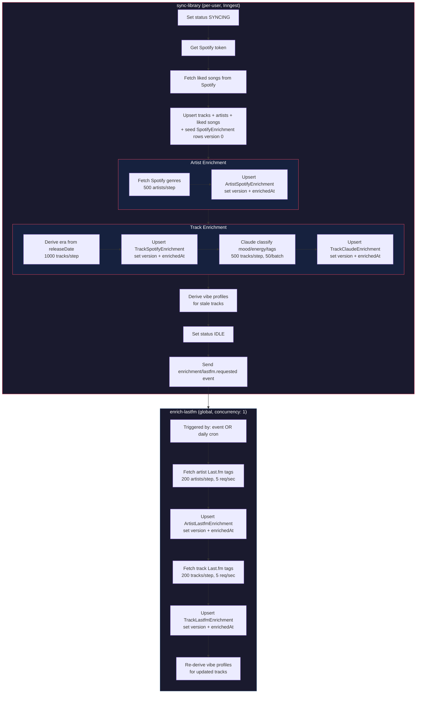
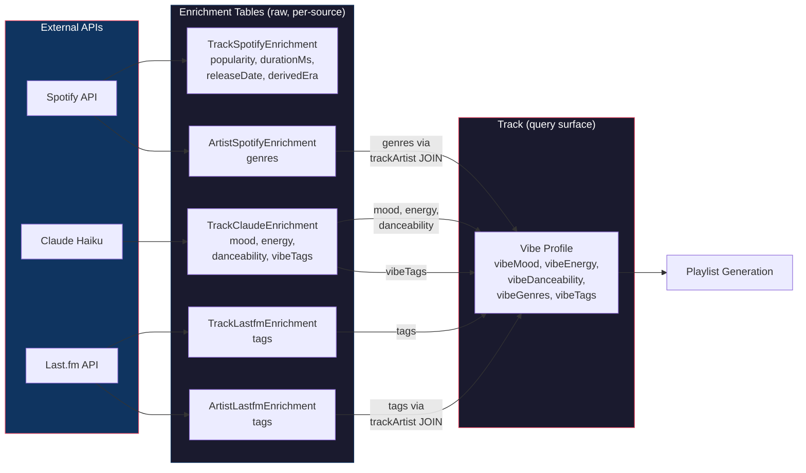
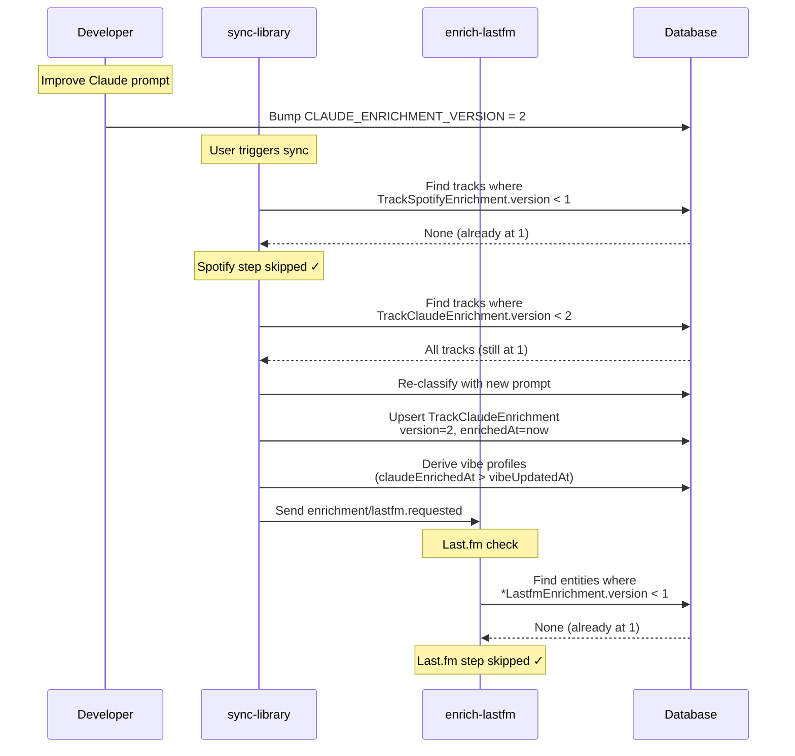

# Plan: Per-Source Enrichment Versioning, Async Last.fm & Vibe Profile

**Status:** Complete
**Created:** 2026-03-22
**Completed:** 2026-04-04 — PRs 1 and 3 shipped; PR 4 (vibe profile derivation) was extracted into its own plan, [`vibe-profile-derivation.md`](vibe-profile-derivation.md).

## Goal

Replace the single `enrichmentVersion` integer with per-source version columns so each enrichment source (Spotify, Claude, Last.fm) can be versioned and re-triggered independently. Extract Last.fm enrichment into a separate Inngest function with global concurrency of 1. Add a derived "vibe profile" layer that normalizes and merges raw source data into canonical, queryable fields — this is the surface that playlist generation queries against.

## Architecture

### Sync & Enrichment Flow



### Data Flow: Sources → Enrichment Tables → Vibe Profile



### Versioning: Independent Re-enrichment



## Context

Today, `enrichmentVersion` is a single integer on Track and Artist. Bumping it re-runs ALL enrichment steps — Spotify genres, era derivation, Claude classification, and Last.fm tags — even if only one source changed. This wastes API calls and time.

Additionally, Last.fm steps run inline during sync, making sync take ~5+ minutes for first-time users. Last.fm's ~5 req/sec rate limit also means concurrent user syncs could exceed the limit since each Inngest step runs in its own serverless invocation with its own in-process throttle.

### What changes

1. **Schema:** Move raw enrichment data off Track/Artist into dedicated enrichment tables (1:1). Add vibe profile columns directly on Track (the query surface). Drop `enrichmentVersion`/`enrichedAt`.
2. **Enrichment constants:** Replace single `CURRENT_ENRICHMENT_VERSION` with per-source version constants.
3. **Repository queries:** Each enrichment source has its own repository or methods querying its own table.
4. **Sync pipeline:** Remove Last.fm steps (5b, 6c) from `sync-library`. Spotify + Claude + era steps use their own version columns and set-version steps.
5. **New Inngest function:** `enrich-lastfm` runs independently with `concurrency: [{ limit: 1 }]`. Triggered after sync completes (via event) or on a cron schedule. Processes all entities globally, not per-user.
6. **Vibe profile:** A derived layer directly on Track that normalizes and merges raw enrichment data from all source tables into canonical, queryable fields. This is the query surface for playlist generation — not the raw source columns.

### Why a vibe profile?

Raw source data is fragmented:
- Claude returns `mood: "melancholic"`, `energy: "low"`, `vibeTags: ["late-night", "rainy-day"]`
- Last.fm returns `lastfmTags: ["post-punk", "indie", "80s"]`
- Spotify returns `spotifyGenres: ["post-punk revival", "new wave"]` (on Artist)

Problems with querying raw columns directly:
- **Vocabulary mismatch:** "post-punk" vs "post-punk revival" vs "Post-Punk" — different sources use different terms for the same concept.
- **Missing data gaps:** If Claude classified a track but Last.fm hasn't run yet (async), queries only hitting `lastfmTags` find nothing. If Last.fm has tags but Claude failed validation, queries only hitting `claudeMood` find nothing.
- **No single truth:** Playlist generation needs to ask "find me melancholic post-punk tracks with low energy" — that cuts across 3 raw sources with no unified field to query.
- **Schema coupling:** Playlist query logic would need to know about every source column and how to combine them. Adding a new source means changing query logic everywhere.

The vibe profile solves this by being the single, canonical, queryable representation:

```
Track vibe profile (derived):
  mood          String?       — from Claude (authoritative)
  energy        String?       — from Claude (authoritative)
  danceability  String?       — from Claude (authoritative)
  genres        String[]      — merged + deduplicated from Spotify genres, Last.fm tags, Claude vibeTags
  tags          String[]      — merged + deduplicated descriptors (e.g., "late-night", "driving", "summer")
  vibeVersion   Int           — bumped when derivation logic changes
  vibeUpdatedAt DateTime?     — when profile was last computed
```

The derivation step runs after any source updates and:
- Takes Claude mood/energy/danceability as authoritative (Claude was asked these questions directly)
- Merges genre-like tags from all sources into a canonical `genres` array (with synonym mapping: "hip hop" / "hip-hop" / "hiphop" → "hip-hop")
- Merges descriptor tags into a canonical `tags` array
- Normalizes casing
- Deduplicates across sources

### Schema: Enrichment tables + vibe profile

Raw enrichment data moves off Track/Artist into dedicated 1:1 tables. Each table owns its own version + enrichedAt. The vibe profile lives directly on Track as the query surface.

**TrackSpotifyEnrichment (new table, 1:1 with Track):**
```prisma
model TrackSpotifyEnrichment {
  trackId            String    @id @map("track_id")
  popularity         Int?
  durationMs         Int?
  releaseDate        String?   @map("release_date")
  derivedEra         String?   @map("derived_era")
  version            Int       @default(0)
  enrichedAt         DateTime? @map("enriched_at")
  track              Track     @relation(fields: [trackId], references: [id], onDelete: Cascade)

  @@map("track_spotify_enrichment")
}
```

**TrackClaudeEnrichment (new table, 1:1 with Track):**
```prisma
model TrackClaudeEnrichment {
  trackId            String    @id @map("track_id")
  mood               String?
  energy             String?
  danceability       String?
  vibeTags           String[]  @default([]) @map("vibe_tags")
  version            Int       @default(0)
  enrichedAt         DateTime? @map("enriched_at")
  track              Track     @relation(fields: [trackId], references: [id], onDelete: Cascade)

  @@map("track_claude_enrichment")
}
```

**TrackLastfmEnrichment (new table, 1:1 with Track):**
```prisma
model TrackLastfmEnrichment {
  trackId            String    @id @map("track_id")
  tags               String[]  @default([])
  version            Int       @default(0)
  enrichedAt         DateTime? @map("enriched_at")
  track              Track     @relation(fields: [trackId], references: [id], onDelete: Cascade)

  @@map("track_lastfm_enrichment")
}
```

**ArtistSpotifyEnrichment (new table, 1:1 with Artist):**
```prisma
model ArtistSpotifyEnrichment {
  artistId           String    @id @map("artist_id")
  genres             String[]  @default([])
  version            Int       @default(0)
  enrichedAt         DateTime? @map("enriched_at")
  artist             Artist    @relation(fields: [artistId], references: [id], onDelete: Cascade)

  @@map("artist_spotify_enrichment")
}
```

**ArtistLastfmEnrichment (new table, 1:1 with Artist):**
```prisma
model ArtistLastfmEnrichment {
  artistId           String    @id @map("artist_id")
  tags               String[]  @default([])
  version            Int       @default(0)
  enrichedAt         DateTime? @map("enriched_at")
  artist             Artist    @relation(fields: [artistId], references: [id], onDelete: Cascade)

  @@map("artist_lastfm_enrichment")
}
```

**Track (cleaned up — raw enrichment columns removed, vibe profile added):**
```
Columns removed from Track:
  spotifyPopularity, spotifyDurationMs, spotifyReleaseDate, derivedEra,
  claudeMood, claudeEnergy, claudeDanceability, claudeVibeTags,
  lastfmTags, enrichmentVersion, enrichedAt

Columns removed from Artist:
  spotifyGenres, lastfmTags, enrichmentVersion, enrichedAt

Vibe profile columns added to Track:
  vibeMood             String?       @map("vibe_mood")
  vibeEnergy           String?       @map("vibe_energy")
  vibeDanceability     String?       @map("vibe_danceability")
  vibeGenres           String[]      @default([]) @map("vibe_genres")
  vibeTags             String[]      @default([]) @map("vibe_tags")
  vibeVersion          Int           @default(0)  @map("vibe_version")
  vibeUpdatedAt        DateTime?     @map("vibe_updated_at")
```

Notes:
- `derivedEra` moves to `TrackSpotifyEnrichment` since it derives from `releaseDate`. Shares the Spotify version — if we re-extract Spotify data, era re-derives too.
- `spotifyPopularity`, `spotifyDurationMs`, `spotifyReleaseDate` move to `TrackSpotifyEnrichment`. These were extracted during sync and previously lived on Track.
- Artist has no Claude enrichment, so no `ArtistClaudeEnrichment` table.
- Enrichment tables use `trackId`/`artistId` as their primary key (1:1 relationship). Rows are upserted — created on first enrichment, updated on re-enrichment.
- Vibe profile lives directly on Track — it's the query surface for playlist generation. No JOIN needed on the hot path.
- Artist genres feed into the vibe profile during derivation via a JOIN through `trackArtist` → `artist` → `artistSpotifyEnrichment`.

### Enrichment constants

```typescript
// src/lib/enrichment.ts
export const SPOTIFY_ENRICHMENT_VERSION = 1;
export const CLAUDE_ENRICHMENT_VERSION = 1;
export const LASTFM_ENRICHMENT_VERSION = 1;
export const VIBE_DERIVATION_VERSION = 1;
```

Start all at 1. Bumping one only re-runs that source. For example, improving the Claude prompt → bump `CLAUDE_ENRICHMENT_VERSION` to 2 → only tracks with `claudeVersion < 2` re-run Claude. Bumping `VIBE_DERIVATION_VERSION` re-derives all vibe profiles (e.g., when synonym map or merge logic changes).

### Async Last.fm function

```typescript
// src/inngest/functions/enrich-lastfm.ts
export const enrichLastfm = inngest.createFunction(
  {
    id: "enrich-lastfm",
    retries: 3,
    concurrency: [{ limit: 1 }], // globally serialized
    triggers: [
      { event: "enrichment/lastfm.requested" },
      { cron: "0 0 * * *" }, // daily safety net
    ],
  },
  async ({ step }) => { ... }
);
```

- Queries ALL entities in the DB with `lastfmVersion < LASTFM_ENRICHMENT_VERSION` (not per-user)
- Chunks at 200 per step, same pattern as today
- `concurrency: [{ limit: 1 }]` — only one instance runs globally, preventing rate limit issues across users
- Triggered by: (a) event sent at end of `sync-library`, (b) cron every 10 minutes as a sweep
- Sets `lastfmVersion` and `lastfmEnrichedAt` after processing each chunk

## Phases and PR Splits

- [x] PR 1: Schema migration + enrichment constants + repository/sync pipeline updates — `feat/per-source-versions-schema`
- [ ] ~~PR 2: Update sync pipeline to per-source versioning~~ — folded into PR 1
- [x] PR 3: Extract Last.fm into async function — `feat/async-lastfm-enrichment`
- [ ] PR 4: Vibe profile derivation — **superseded by standalone plan: [`vibe-profile-derivation.md`](vibe-profile-derivation.md)** (split into PR 4a pure function + PR 4b wiring)

PR 1 absorbed the planned PR 2 scope (repository methods and sync pipeline updates). PRs 3 and 4 remain sequential.

---

### PR 1: Schema migration + enrichment constants

**Branch:** `feat/per-source-versions-schema`

**Files (~8):**

1. `prisma/schema.prisma` — create 5 enrichment tables, remove raw enrichment columns from Track/Artist, add vibe profile columns to Track
2. `prisma/migrations/<timestamp>/migration.sql` — generated. Destructive (dropping columns). No data migration needed — zeroing out.
3. `src/db/types.ts` — regenerated
4. `src/domain/song.ts` — update Track and Artist types to reflect new schema. Add domain types for enrichment tables.
5. `src/lib/enrichment.ts` — replace `CURRENT_ENRICHMENT_VERSION` with `SPOTIFY_ENRICHMENT_VERSION`, `CLAUDE_ENRICHMENT_VERSION`, `LASTFM_ENRICHMENT_VERSION`, `VIBE_DERIVATION_VERSION`
6. `src/repositories/track.repository.ts` — update `upsertMany` to seed `TrackSpotifyEnrichment` rows with `version: 0`
7. `tests/lib/enrichment.test.ts` — update version assertions
8. `tests/repositories/track.repository.test.ts` — update `upsertMany` tests for enrichment row seeding
9. `src/app/(app)/create/page.test.tsx` — update `makeSong` helper (remove old enrichment fields, add vibe profile fields)
10. `src/app/(app)/create/confirm/page.test.tsx` — update `makeSong` helper
11. Frontend consumers of `Track`/`TrackWithLikedAt` — review `create/page.tsx`, `create/confirm/page.tsx`, `dashboard/page.tsx` and any other pages that reference removed columns. Typecheck will surface these but expect additional files.

**Migration strategy:**
- Create 5 new enrichment tables with `@default(0)` version columns
- Add vibe profile columns to Track (nullable + array defaults)
- Drop raw enrichment columns from Track (`spotifyPopularity`, `spotifyDurationMs`, `spotifyReleaseDate`, `derivedEra`, `claudeMood`, `claudeEnergy`, `claudeDanceability`, `claudeVibeTags`, `lastfmTags`, `enrichmentVersion`, `enrichedAt`)
- Drop raw enrichment columns from Artist (`spotifyGenres`, `lastfmTags`, `enrichmentVersion`, `enrichedAt`)
- No data migration — zeroing out. All entities start stale, full re-enrichment on next sync.

**`SpotifyLikedSong` type unchanged:** The type in `src/lib/spotify.ts` still includes `spotifyPopularity`, `spotifyDurationMs`, `spotifyReleaseDate` — the API response hasn't changed, just the destination table. No type changes needed.

**`upsertMany` update (PR 1):**
`trackRepository.upsertMany` currently writes `spotifyPopularity`, `spotifyDurationMs`, `spotifyReleaseDate` to the Track table. After migration these columns live on `TrackSpotifyEnrichment`. Update `upsertMany` to also upsert a `TrackSpotifyEnrichment` row with these three fields and `version: 0`. This seeds the enrichment row during sync so the data isn't lost. The Spotify enrichment step in PR 2 then handles era derivation + version bump. Similarly, update the artist upsert to seed `ArtistSpotifyEnrichment` rows with `version: 0` (genres are populated later by the enrichment step).

**Domain type changes (Track):**
```typescript
// Remove:
spotifyPopularity: number | null;
spotifyDurationMs: number | null;
spotifyReleaseDate: string | null;
derivedEra: string | null;
claudeMood: string | null;
claudeEnergy: string | null;
claudeDanceability: string | null;
claudeVibeTags: string[];
lastfmTags: string[];
enrichmentVersion: number;
enrichedAt: Date | null;

// Add (vibe profile):
vibeMood: string | null;
vibeEnergy: string | null;
vibeDanceability: string | null;
vibeGenres: string[];
vibeTags: string[];
vibeVersion: number;
vibeUpdatedAt: Date | null;
```

**Domain type changes (Artist):**
```typescript
// Remove:
spotifyGenres: string[];
lastfmTags: string[];
enrichmentVersion: number;
enrichedAt: Date | null;
```

**New domain types for enrichment tables:**
- `TrackSpotifyEnrichment`, `TrackClaudeEnrichment`, `TrackLastfmEnrichment`
- `ArtistSpotifyEnrichment`, `ArtistLastfmEnrichment`

---

### PR 2: Update sync pipeline to per-source versioning

**Branch:** `feat/per-source-sync-pipeline`

**Files (~6):**

1. `src/repositories/track-spotify-enrichment.repository.ts` — **new**. `findStale(version, limit)`, `upsert(data)`, `setVersion(version, limit)`. Queries `track_spotify_enrichment` table.
2. `src/repositories/track-claude-enrichment.repository.ts` — **new**. `findStaleWithArtists(version, limit)` (JOINs track + trackArtist + artist for artist name), `upsert(data)`, `setVersion(version, limit)`.
3. `src/repositories/artist-spotify-enrichment.repository.ts` — **new**. `findStale(version, limit)`, `upsert(data)`, `setVersion(version, limit)`.
4. `src/repositories/track.repository.ts` — remove `findStale`, `findStaleWithArtists`, `updateDerivedEra`, `updateClaudeClassification`, `updateLastfmTags`, `setEnrichmentVersion`. These move to enrichment repos.
5. `src/repositories/artist.repository.ts` — remove `findStale`, `updateGenres`, `updateLastfmTags`, `setEnrichmentVersion`. These move to enrichment repos.
6. `src/inngest/functions/sync-library.ts` — rewrite enrichment steps to use new enrichment repos. Upsert enrichment rows (create on first enrichment). Remove Last.fm steps 5b/6c (move to PR 3). Remove Last.fm imports.
7. `tests/` — new tests for enrichment repos, update sync-library tests, remove Last.fm-related tests

**Key change in sync pipeline step ordering:**
```
enrich-artists/spotify-genres → enrich-artists/set-spotify-version
enrich-tracks/era → enrich-tracks/claude-classify → enrich-tracks/set-spotify-version → enrich-tracks/set-claude-version
```

Note: era derivation lives in `TrackSpotifyEnrichment` since it derives from `releaseDate`. The Spotify enrichment step handles both data extraction and era derivation.

**Enrichment row lifecycle:** Rows in enrichment tables are upserted — `INSERT ... ON CONFLICT (track_id) DO UPDATE`. Created on first enrichment, updated on re-enrichment. A track with no enrichment row is stale by definition.

**`findStale` query pattern:** All `findStale` methods query from the parent table (`track` or `artist`) with a LEFT JOIN to the enrichment table. `WHERE enrichment.version IS NULL OR enrichment.version < X`. This catches both missing rows (never enriched) and stale rows (version behind). Consistent pattern across all enrichment repos.

---

### PR 3: Extract Last.fm into async function

**Branch:** `feat/async-lastfm-enrichment`

**Files (~5):**

1. `src/repositories/track-lastfm-enrichment.repository.ts` — **new**. `findStaleWithPrimaryArtist(version, limit)`, `upsert(data)`, `setVersion(version, limit)`.
2. `src/repositories/artist-lastfm-enrichment.repository.ts` — **new**. `findStale(version, limit)`, `upsert(data)`, `setVersion(version, limit)`.
3. `src/inngest/functions/enrich-lastfm.ts` — **new**. Standalone function with `concurrency: [{ limit: 1 }]`. Processes both artist and track Last.fm tags. Chunked loops (200/step). Upserts enrichment rows per chunk.
4. `src/app/api/inngest/route.ts` — register the new function
5. `src/inngest/functions/sync-library.ts` — send `enrichment/lastfm.requested` event at end of sync
6. `tests/inngest/functions/enrich-lastfm.test.ts` — **new**
7. `tests/inngest/functions/sync-library.test.ts` — add test for event emission
8. `tests/repositories/` — new tests for Last.fm enrichment repos

**Inngest function design:**
- Triggers: event `enrichment/lastfm.requested` + daily cron `0 0 * * *` (safety net)
- `concurrency: [{ limit: 1 }]` — one instance globally
- Process artist tags first (fewer entities), then track tags
- Same try/catch per entity pattern as today
- Upserts enrichment rows (sets version + enrichedAt)
- Returns `{ artistsProcessed, tracksProcessed }` for observability

### PR 4: Vibe profile derivation

**Prerequisite:** After PR 3 ships, run a full sync + Last.fm enrichment to populate real tag data. Query `lastfmTags` and `spotifyGenres` to build the genre vocabulary, synonym map, and junk-tag ignore list before starting implementation.

**Branch:** `feat/vibe-profile`

**Files (~8):**

1. `src/lib/vibe-profile.ts` — **new**. Pure function: takes raw track data + artist genres → produces vibe profile. Handles synonym mapping, deduplication, merge logic.
6. `src/inngest/functions/sync-library.ts` — add vibe profile derivation step after Claude classification and Spotify/Claude version bumps
7. `src/inngest/functions/enrich-lastfm.ts` — add vibe profile re-derivation step at the end, for tracks that were just updated
8. `tests/lib/vibe-profile.test.ts` — **new**
9. `tests/inngest/functions/sync-library.test.ts` — add vibe derivation step tests
10. `tests/inngest/functions/enrich-lastfm.test.ts` — add vibe re-derivation step tests

**Vibe profile derivation logic (`src/lib/vibe-profile.ts`):**

```typescript
export type VibeProfile = {
  mood: string | null;
  energy: string | null;
  danceability: string | null;
  genres: string[];
  tags: string[];
};

export function deriveVibeProfile(input: {
  claude: { mood: string | null; energy: string | null; danceability: string | null; vibeTags: string[] } | null;
  lastfm: { tags: string[] } | null;
  artistSpotify: { genres: string[] } | null;
}): VibeProfile;
```

**Source priority for each field:**
- `mood` — Claude (authoritative, only source)
- `energy` — Claude (authoritative, only source)
- `danceability` — Claude (authoritative, only source)
- `genres` — merge Spotify artist genres + Last.fm tags that look like genres (matched against a genre vocabulary) + Claude vibeTags that look like genres. Deduplicate via synonym map.
- `tags` — merge Claude vibeTags + Last.fm tags that are descriptors (not genres). Deduplicate. Examples: "late-night", "driving", "summer", "workout".

**Genre vs tag classification:** A simple vocabulary-based approach. Maintain a set of known genre terms (e.g., "rock", "pop", "hip-hop", "electronic", "jazz", "indie", "r&b", etc.). Tags matching the vocabulary (after synonym normalization) go into `genres`. Everything else goes into `tags`. This is imperfect but good enough for MVP — can always improve the vocabulary later.

**Synonym mapping (`src/lib/vibe-profile.ts`):**
A static map of common synonyms:
```typescript
const SYNONYMS: Record<string, string> = {
  "hip hop": "hip-hop",
  "hiphop": "hip-hop",
  "rnb": "r&b",
  "r and b": "r&b",
  "post punk": "post-punk",
  "post punk revival": "post-punk",
  "indie rock": "indie-rock",
  "electronic music": "electronic",
  // ... extend as needed
};
```

Start small — 20-30 entries. Easy to expand without code changes (just add entries).

**When to derive (two call sites, same pure function):**
- After sync completes (Spotify + Claude data available) — chunked step at end of `sync-library`, before `update-status`. Derives with whatever data is available (Last.fm may not have run yet).
- After Last.fm enrichment completes — chunked step at end of `enrich-lastfm`, re-derives for tracks that were just updated to merge in new Last.fm tags.
- The derivation is idempotent — re-running produces the same result given the same inputs. Running twice (once after sync, once after Last.fm) is cheap since it's pure DB with no API calls.
- Gated by `vibeVersion`: only re-derive when derivation logic version changes or when source data is newer than `vibeUpdatedAt`

**Staleness detection for vibe profile:**
A track's vibe profile is stale when any of these are true:
- `track.vibeUpdatedAt IS NULL` (never derived)
- `track.vibeVersion < VIBE_DERIVATION_VERSION` (derivation logic changed)
- `trackSpotifyEnrichment.enrichedAt > track.vibeUpdatedAt` (Spotify data refreshed)
- `trackClaudeEnrichment.enrichedAt > track.vibeUpdatedAt` (Claude data refreshed)
- `trackLastfmEnrichment.enrichedAt > track.vibeUpdatedAt` (Last.fm data refreshed)

Implemented via LEFT JOINs to the enrichment tables with individual OR conditions — NULL-safe. A missing enrichment row (no JOIN match) means that source hasn't run yet and won't trigger re-derivation on its own. But `vibeUpdatedAt IS NULL` catches tracks that have never been derived regardless.

This means the vibe profile automatically re-derives when any upstream source is re-enriched — no manual version bumping needed for source changes.

**Artist enrichment → vibe invalidation:** When artist enrichment steps write new data (Spotify genres or Last.fm tags), they also set `vibeUpdatedAt = NULL` on all tracks by that artist (bulk UPDATE through `trackArtist` JOIN). This marks those tracks' vibe profiles as stale, which the existing `vibeUpdatedAt IS NULL` condition catches. No complex JOINs needed in the staleness query — the invalidation is explicit and push-based.

**Repository methods:**
- `trackRepository.findStaleVibeProfiles(version, limit)`: LEFT JOINs to enrichment tables. Tracks where `vibeUpdatedAt IS NULL` OR `vibeVersion < version` OR any enrichment `enrichedAt > vibeUpdatedAt`. Individual OR conditions, NULL-safe.
- `trackRepository.updateVibeProfiles(updates: { id, vibeMood, vibeEnergy, vibeDanceability, vibeGenres, vibeTags }[])`: Transactional batch update on Track table, sets `vibeVersion` and `vibeUpdatedAt`

**Tests:**
- Synonym normalization ("hip hop" → "hip-hop", "Hip-Hop" → "hip-hop")
- Genre vs tag classification (known genres go to `genres`, unknown descriptors go to `tags`)
- Deduplication across sources (same tag from Claude and Last.fm → appears once)
- Claude fields pass through as authoritative (mood, energy, danceability)
- Missing source data handled gracefully (no Claude → mood/energy/danceability null, no Last.fm → only Claude/Spotify tags)
- Sync pipeline step ordering includes vibe derivation
- Vibe profile re-derives when source data is newer

---

## Verification

After all 4 PRs:
1. `npx tsc --noEmit` — typecheck
2. `npm test` — all tests pass
3. Manual: trigger sync → verify Spotify/Claude steps complete and sync finishes without waiting for Last.fm → verify Last.fm function picks up entities asynchronously
4. Manual: bump only `CLAUDE_ENRICHMENT_VERSION` → verify only Claude re-runs on next sync
5. Manual: verify vibe profile populates after sync (mood/energy/danceability from Claude, genres merged from all sources)
6. Manual: trigger Last.fm enrichment → verify vibe profile re-derives with new Last.fm data merged in

## Open Questions

- ~~Should the cron interval be configurable?~~ **Resolved: hardcoded daily (`0 0 * * *`).** The event trigger handles the normal flow after sync. Cron is just a safety net — no need to burn Inngest executions every 10 minutes.
- ~~Should `sync-library` wait for Last.fm?~~ **Resolved: no.** Set IDLE immediately after Spotify + Claude. User has usable data (mood, energy, danceability, Spotify genres) right away. Last.fm tags and vibe profile re-derivation happen in the background.
- ~~Should we add a `lastfmVersion` column to Track?~~ **Resolved: moot.** The table-based design handles this — `TrackLastfmEnrichment.version` gates re-enrichment. Missing row = not yet enriched. Row with `tags: []` = enriched, no tags found.
- ~~Carry forward or zero out?~~ **Resolved: zero out.** No important data in the DB right now. Migration sets all source version columns to 0, constants start at 1. Full re-enrichment validates the new system end-to-end.
- ~~How should the genre vocabulary be maintained?~~ **Resolved: static `Set` in code, seeded from real data.** After PR 3 ships, run a sync + Last.fm enrichment to populate real `lastfmTags` and `spotifyGenres` data. Query that data to build the genre set, synonym map, and junk-tag ignore list. This must happen *before* starting PR 4 — the vocabulary is a prerequisite for vibe profile derivation.
- ~~Should the vibe profile derivation also run inside `enrich-lastfm`?~~ **Resolved: yes.** Vibe derivation runs in both `sync-library` (after Spotify + Claude) and `enrich-lastfm` (after Last.fm tags are written). Two call sites, same pure function.

## Files Modified

## Session Notes

- **PR 3: Skipped dedicated Last.fm enrichment repositories.** The plan called for `track-lastfm-enrichment.repository.ts` and `artist-lastfm-enrichment.repository.ts`, but the relevant methods (`findStale`, `updateLastfmTags`, `setEnrichmentVersion`, `findStaleWithPrimaryArtist`) already exist on `trackRepository` and `artistRepository`. Creating wrapper repos for 2-3 methods each would add indirection without value. The new `enrich-lastfm` function imports directly from the existing repos.
