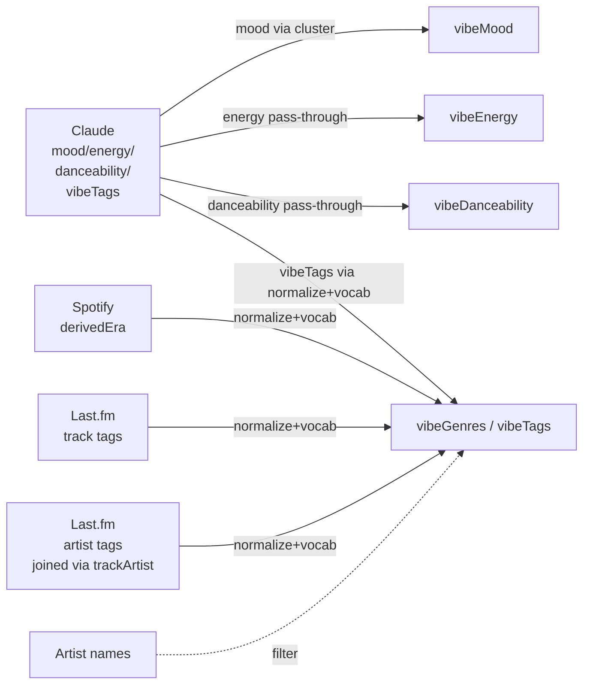

# Plan: Vibe Profile Derivation

**Status:** Complete
**Created:** 2026-04-04
**Completed:** 2026-04-04 — PR 4a (#39) shipped the pure function, PR 4b (#40) wired it into the sync + Last.fm pipelines. Live run against the local DB produced clean canonical moods (11-way cluster) and normalized genre/tag arrays for all 1,457 tracks, with 146 null moods matching the hybrid cluster policy (72 original Claude failures + 74 intentionally-excluded ambiguous terms like `soulful`/`groovy`). Next: Claude prompt v2 to constrain mood at the source, shrinking the 74-gap to zero.
**Parent plan:** [`per-source-versioning-async-lastfm.md`](per-source-versioning-async-lastfm.md) — PR 4 section is superseded by this document.

> **Historical note:** This plan's `MOOD_CLUSTER` map (the ~90-entry
> `Record<string, CanonicalMood>`) was deleted in the follow-up
> [`claude-prompt-v2-canonical-moods.md`](claude-prompt-v2-canonical-moods.md)
> plan once Claude was constrained to emit canonical moods directly.
> Code samples in this document referencing `MOOD_CLUSTER` reflect the
> originally-shipped implementation — the current implementation in
> `src/lib/vibe-profile.ts` does a direct `CANONICAL_MOOD_SET.has()`
> vocabulary check instead.

## Goal

Add a derived "vibe profile" layer on the `track` table that merges and
normalizes raw enrichment data from Claude and Last.fm into a small set of
canonical, queryable fields. This is the surface playlist generation will
query against — not the raw `track_claude_enrichment` / `track_lastfm_enrichment`
tables.

Derivation runs automatically at the end of every sync **and** at the end of
every Last.fm enrichment, via the same pure function invoked from two call
sites. Tracks whose upstream data changes are flagged stale and re-derived on
the next run.

## Context and constraints

This plan was written after PRs 1–3 of the parent plan landed and all 1,457
tracks / 891 artists in the local DB had been fully enriched. The design is
informed by what the real data actually looks like rather than what we hoped
it would look like.

**Constraints that shape the design:**

- **No Spotify artist genres.** `artist_spotify_enrichment.genres` is empty
  for all 891 artists and will stay that way (dev-mode restriction —
  see [ADR 010](../../decisions/010-personal-use-only.md)). The only sources
  for genre-like data are Last.fm track tags, Last.fm artist tags, and Claude
  `vibeTags`. The parent plan assumed Spotify artist genres would be a source;
  that is removed here.
- **~5% of tracks have no Claude classification** (72/1,457 in the current
  snapshot). Derivation must handle `claude = null` gracefully — `vibeMood`
  / `vibeEnergy` / `vibeDanceability` stay null, genres and tags still come
  from Last.fm if available.
- **Personal use only.** Performance and scale are non-concerns. Correctness
  and queryability are the goals.

## Real-data survey

Ran before writing this plan. Drives the synonym map, genre vocabulary,
ignore list, and mood cluster map below.

**Top Last.fm genre-like tags (artist + track):** `rock`, `pop`, `hip-hop`,
`rap`, `electronic`, `soul`, `alternative rock`, `classic rock`, `indie`,
`alternative`, `dance`, `hard rock`, `funk`, `house`, `indie rock`, `jazz`,
`folk`, `pop punk`, `disco`, `reggae`, `punk rock`, `nu metal`, `grunge`,
`metal`, `metalcore`, `new wave`, `synthpop`, `blues`, `ambient`, `emo`,
`dubstep`, `trip-hop`, `doo wop`, `swing`, `eurodance`, `motown`.

**Observed synonym variants:** `hip-hop` ↔ `hip hop`; `rnb` ↔ `R&B`;
`alternative rock` ↔ `alternative-rock`; `indie rock` ↔ `indie-rock`;
`pop punk` ↔ `pop-punk`; `post punk` ↔ `post-punk revival`; `nu metal` ↔
`nu-metal`; `hard rock` ↔ `hard-rock`. Each appears in multiple variants in
the current data and has to collapse to one canonical form.

**Junk tags observed:** artist names leaking as track tags (`kanye west`,
`maroon 5`, `avicii`), `love`, `cover`, `cult`, `party`, `female vocalists`,
`male vocalists`, `soundtrack`, `seen live`, `favourites`. Filtered via
ignore list + artist-name filter.

**Decade tags:** `50s` / `60s` / `70s` / `80s` / `90s` show up frequently.
These are descriptors — they belong in `vibeTags`, not `vibeGenres`.

**Claude `vibeTags` distribution** is a mix of genres (`hip-hop`, `rock`,
`pop`, `funk`, `metal`, `soul`, `disco`) and descriptors (`emotional`,
`intense`, `introspective`, `fun`, `party`, `feel-good`, `driving`, `powerful`,
`energetic`, `heavy`, `catchy`, `smooth`, `dark`, `upbeat`, `vintage`,
`groovy`, `atmospheric`). Both get fed through the same normalizer + vocab
classifier — no special-casing by source.

**Claude `mood` distribution** has 90 distinct values and a very long tail.
Top: `uplifting` (220), `energetic` (176), `aggressive` (149), `melancholic`
(126), `romantic` (58), `nostalgic` (48), `confident` (45), `euphoric` (41),
`dark` (41), `intense` (39), `joyful` (37), `dreamy` (31), `playful` (27).
Tail includes 1-off values like `angst-driven`, `adrenaline-fueled`,
`transcendent`. A cluster map is mandatory — playlist generation needs a
small fixed vocabulary it can query against.

## Schema

Already in place from PR 1 of the parent plan. No migration needed:

```
Track:
  vibeMood          String?
  vibeEnergy        String?
  vibeDanceability  String?
  vibeGenres        String[]   @default([])
  vibeTags          String[]   @default([])
  vibeVersion       Int        @default(0)
  vibeUpdatedAt     DateTime?
```

Version constant already declared in `src/lib/enrichment.ts`:

```ts
export const VIBE_DERIVATION_VERSION = 1;
```

## Design

### The pure function

```ts
// src/lib/vibe-profile.ts
export type VibeProfile = {
  mood: string | null;
  energy: string | null;
  danceability: string | null;
  genres: string[];  // canonical, deduplicated, capped
  tags: string[];    // canonical, deduplicated, capped
};

export function deriveVibeProfile(input: {
  claude: {
    mood: string | null;
    energy: string | null;
    danceability: string | null;
    vibeTags: string[];
  } | null;
  trackSpotify: { derivedEra: string | null } | null;
  trackLastfm: { tags: string[] } | null;
  artistLastfmTags: string[];   // merged across all of the track's artists
  artistNames: string[];        // for the artist-name filter
}): VibeProfile;
```

Pure — no DB, no I/O, no globals. Everything it needs is in the input.
All DB fetching happens in the caller and is passed in. This is what makes
it trivial to unit test in isolation.

**What Spotify data we do and don't consume.** `trackSpotifyEnrichment` has
four useful columns: `popularity`, `releaseDate`, `durationMs`, and
`derivedEra`. Only `derivedEra` feeds the vibe profile — it's the cleanest
era signal we have (computed from authoritative release dates, not
crowd-sourced tagging). `popularity` is dead in dev mode (Spotify returns
`undefined`). `durationMs` isn't a vibe descriptor. `artistSpotifyEnrichment.genres`
is dead in dev mode (empty for all artists). See
[ADR 010](../../decisions/010-personal-use-only.md) and
[spotify-dev-mode-restrictions.md](../../notes/spotify-dev-mode-restrictions.md).

### Normalization pipeline

Helper inside `vibe-profile.ts`:

```ts
function normalizeTag(
  raw: string,
  artistNamesNormalized: Set<string>,
): string | null;
```

Returns `null` if the tag should be dropped. Steps:

1. Lowercase, trim, collapse repeated whitespace.
2. Apply `SYNONYMS` map (see below) — maps known variants to canonical form.
3. Check `IGNORE_LIST` — return `null` if matched.
4. Check `artistNamesNormalized` — return `null` if the normalized tag
   matches any artist name on the track.
5. Otherwise return the canonical form.

**Who owns `artistNamesNormalized`?** `deriveVibeProfile` itself. The pure
function receives `artistNames: string[]` (raw, from the DB) in its input
and constructs `new Set(artistNames.map(n => n.toLowerCase().trim().replace(/\s+/g, ' ')))`
once at the top, then passes that Set into every `normalizeTag` call. The
repository method builds `StaleVibeProfileRow` with raw artist name strings
and doesn't need to know about normalization at all.

### Synonym map (initial)

Seeded from the real variants observed in the DB survey. Extended as we
find more variants.

**Canonical form rules:**

- Multi-word terms use hyphens: `alternative-rock`, `pop-punk`, `hip-hop`,
  `nu-metal`, `post-punk`.
- Single-word compound terms stay unhyphenated: `synthpop`, `britpop`,
  `shoegaze`.
- Terms with punctuation preserve it: `r&b` (not `r-and-b`).
- Decade tags use their conventional short/long form: `80s` / `90s` for
  the 1900s, `2010s` / `2020s` for post-2000. See "Decade normalization"
  below.

```ts
const SYNONYMS: Record<string, string> = {
  // hip-hop family
  "hip hop": "hip-hop",
  "hiphop": "hip-hop",
  "trip hop": "trip-hop",
  // r&b
  "rnb": "r&b",
  "r and b": "r&b",
  "r & b": "r&b",
  // rock subgenres
  "alternative rock": "alternative-rock",
  "indie rock": "indie-rock",
  "indie pop": "indie-pop",
  "pop punk": "pop-punk",
  "pop rock": "pop-rock",
  "punk rock": "punk-rock",
  "hard rock": "hard-rock",
  "classic rock": "classic-rock",
  "progressive rock": "progressive-rock",
  "psychedelic rock": "psychedelic-rock",
  "garage rock": "garage-rock",
  "glam rock": "glam-rock",
  "stoner rock": "stoner-rock",
  "rock and roll": "rock-and-roll",
  "rock & roll": "rock-and-roll",
  // metal
  "nu metal": "nu-metal",
  "heavy metal": "heavy-metal",
  "thrash metal": "thrash-metal",
  "death metal": "death-metal",
  "alternative metal": "alternative-metal",
  "doom metal": "doom-metal",
  "power metal": "power-metal",
  "black metal": "black-metal",
  // post- family
  "post punk": "post-punk",
  "post-punk revival": "post-punk",
  "post hardcore": "post-hardcore",
  "post rock": "post-rock",
  // other
  "new wave": "new-wave",
  "synth pop": "synthpop",
  "doo wop": "doo-wop",
  "drum and bass": "drum-and-bass",
  "drum n bass": "drum-and-bass",
  "dnb": "drum-and-bass",
  "lo fi": "lo-fi",
  "lofi": "lo-fi",
  "jungle": "jungle",
  // decades — long form for 1900s collapses to short form; 2000s+ stays long
  "1950s": "50s",
  "1960s": "60s",
  "1970s": "70s",
  "1980s": "80s",
  "1990s": "90s",
  "early-2000s": "2000s",
};
```

### Decade normalization

Canonical decade forms are **mixed by intention**: `50s`, `60s`, `70s`,
`80s`, `90s` for the 1900s (reads natural), `2000s`, `2010s`, `2020s` for
post-2000 (`00s`/`10s`/`20s` are ambiguous). The split year is 2000.

**Long-form → short form for 1900s** is handled by the synonym map above.
`2000s`/`2010s`/`2020s` pass through unchanged since they're already
canonical.

**Specific years** (`1979`, `2011`, `2020`) are collapsed to their decade
via a regex rule inside `normalizeTag`, applied after synonym lookup but
before the ignore list:

```ts
// Inside normalizeTag, after SYNONYMS lookup:
const yearMatch = tag.match(/^(19|20)(\d)\d$/);
if (yearMatch) {
  const century = yearMatch[1];
  const decadeDigit = yearMatch[2];
  tag = century === "19" ? `${decadeDigit}0s` : `${century}${decadeDigit}0s`;
}
```

So `1979` → `70s`, `2011` → `2010s`, `2020` → `2020s`. Preserves the era
signal at coarser granularity and dedupes naturally with explicitly-tagged
decades.

**Compound decade tags** (`80s funk`, `90s-hip-hop`, `80s-rock`) are left
as-is. They land in `vibeTags` as single tokens (`80s funk` stays
`80s funk`). Splitting them into `80s` + `funk` is a complexity we don't
need for MVP — compound decade tags are low-frequency and the primary
decade signal already comes through cleaner sources (explicit `80s` tags
and Spotify `derivedEra`).

### Ignore list

```ts
const IGNORE: Set<string> = new Set([
  "love", "cover", "cult", "party", "favorite", "favorites",
  "favourite", "favourites", "female vocalists", "male vocalists",
  "seen live", "awesome", "best", "amazing", "beautiful", "chill",
  "favorite songs", "my music", "good", "great", "soundtrack",
  "vocal", "vocals", "singer-songwriter", "singer songwriter",
]);
```

`soundtrack` and `singer-songwriter` are borderline — they describe *how* a
track exists, not what it sounds like. Dropped for now; can revisit if
playlist generation wants them.

### Genre vocabulary

Canonical forms only. Anything normalized that matches goes to `vibeGenres`;
everything else goes to `vibeTags`.

```ts
const GENRE_VOCAB: Set<string> = new Set([
  // top-level
  "rock", "pop", "hip-hop", "rap", "electronic", "soul", "r&b", "jazz",
  "folk", "country", "blues", "metal", "punk", "indie", "alternative",
  "dance", "funk", "disco", "reggae", "latin", "classical", "gospel",
  "world",
  // rock subgenres
  "alternative-rock", "classic-rock", "hard-rock", "indie-rock", "pop-rock",
  "punk-rock", "progressive-rock", "psychedelic-rock", "garage-rock",
  "glam-rock", "stoner-rock", "rock-and-roll", "grunge", "post-rock",
  "post-punk", "new-wave", "britpop", "shoegaze",
  // metal subgenres
  "heavy-metal", "thrash-metal", "death-metal", "nu-metal",
  "alternative-metal", "metalcore", "post-hardcore", "hardcore", "doom-metal",
  "power-metal", "black-metal",
  // hip-hop / r&b adjacent
  "trap", "drill", "boom-bap", "trip-hop",
  // electronic subgenres
  "house", "techno", "trance", "dubstep", "drum-and-bass", "ambient",
  "synthpop", "eurodance", "hyperpop", "lo-fi", "idm",
  // pop subgenres
  "pop-punk", "indie-pop", "dream-pop", "synth-pop",
  // other
  "ska", "motown", "doo-wop", "swing", "afrobeat", "reggaeton",
  "emo", "experimental",
]);
```

~75 entries. Grouped by family for readability, single Set at runtime.
Tune iteratively — if a tag shows up in the tail often enough to matter,
add it; if it never does, don't.

### Mood cluster map

Claude `mood` is free-form (90 distinct values). Map to a fixed set of
~10 canonical moods. Returns `null` if the incoming mood doesn't match any
cluster — better to show nothing than to show an unreliable label.

**Canonical moods (11):**

| Canonical | Members |
|---|---|
| `uplifting` | uplifting, joyful, euphoric, cheerful, carefree, triumphant, empowering, hopeful, inspirational, soaring, festive, fun, exhilarating, thrilling, motivational, spiritual, transcendent |
| `energetic` | energetic, upbeat, powerful, epic, anthemic, adrenaline-fueled, determined |
| `aggressive` | aggressive, angry, intense, heavy, edgy, rebellious, chaotic, tense, angst-driven, angst-filled, unsettling |
| `melancholic` | melancholic, sad, wistful, sentimental, bittersweet, vulnerable, heartfelt |
| `romantic` | romantic, tender, passionate, sensual, sultry, warm, charming, loving |
| `nostalgic` | nostalgic, timeless, contemplative, introspective, reflective |
| `dark` | dark, moody, haunting, mysterious, eerie, ominous |
| `dreamy` | dreamy, ethereal, atmospheric, hypnotic, psychedelic, cinematic |
| `playful` | playful, whimsical, quirky, humorous |
| `confident` | confident, cool, boastful, funky, swaggering |
| `peaceful` | peaceful, calm, relaxed, mellow, laid-back, chill, tranquil |

**Intentionally excluded from the cluster map** (fall through to null):
`soulful` (valid across sad / romantic / confident — too ambiguous to cluster
reliably), `groovy` (rhythm-feel, already captured by `danceability`),
`thriller` (genre descriptor, not a mood — Claude doesn't return it in
practice). These return `null` rather than guessing.

`peaceful` is kept separate from `dreamy` because "calm" and "ethereal" feel
different enough to query for. Final count is 11 — locked for PR 4a unless
review surfaces a reason to change it.

Implemented as a flat `Record<string, CanonicalMood>` so lookup is O(1):

```ts
const MOOD_CLUSTER: Record<string, CanonicalMood> = {
  "uplifting": "uplifting",
  "joyful": "uplifting",
  "euphoric": "uplifting",
  // ...
};

function clusterMood(raw: string | null): CanonicalMood | null {
  if (!raw) return null;
  return MOOD_CLUSTER[raw.toLowerCase().trim()] ?? null;
}
```

**Follow-up (not in this plan):** bump `CLAUDE_ENRICHMENT_VERSION` to 2 and
update `src/lib/prompts/classify-tracks.ts` to instruct Claude to pick mood
from the canonical list directly. That tightens the data at the source and
eliminates the cluster map. Deferred to a separate plan — PR 4 handles the
read-side clustering as the source of truth for now.

### Energy and danceability

Claude already returns a clean `low` / `medium` / `high` enum for both.
Pass through unchanged. If Claude has no classification (`claude = null`),
both stay null.

### Merge, rank, and cap algorithm

Given normalized tags from Claude, Last.fm track, and Last.fm artist sources,
produce `vibeGenres` and `vibeTags` via this deterministic pipeline:

1. **Collect candidates** from every source into a flat list of
   `{tag, sourceRank, withinSourceIndex}` entries:
   - `sourceRank = 0` for Claude `vibeTags`
   - `sourceRank = 0` for Spotify `derivedEra` (single-element source, tied
     with Claude — authoritative era from release date math)
   - `sourceRank = 1` for Last.fm track tags
   - `sourceRank = 2` for Last.fm artist tags
   - Lower rank = higher precedence.
   - `withinSourceIndex` is the position in the input list for that source
     (preserves per-source ordering, which is popularity-order for Last.fm
     and prompt-order for Claude). Spotify `derivedEra` uses `withinSourceIndex = 0`.
   - `artistLastfmTags` is pre-merged by the caller: sort the track's artist
     IDs alphabetically, then concatenate each artist's tag array preserving
     per-artist Last.fm order. This makes the merge deterministic for
     multi-artist tracks.
   - If `trackSpotify.derivedEra` is null/missing, just skip it as a source
     — no entry added to the candidate list.

2. **Normalize each tag** via `normalizeTag(raw, artistNamesNormalized)`.
   Drop `null` results (ignore list, artist-name match, empty).

3. **Dedupe with promotion.** Build a
   `Map<canonicalTag, {bestSourceRank, minWithinSourceIndex, hitCount}>`.
   For each normalized candidate:
   - If not present, insert with `hitCount = 1`.
   - If present, increment `hitCount`, take `min(bestSourceRank)` and
     `min(minWithinSourceIndex)` across all occurrences.

4. **Rank the deduped list** by sort key, descending priority:
   `(hitCount DESC, bestSourceRank ASC, minWithinSourceIndex ASC)`.
   - A tag hit in 2 sources outranks a 1-source tag, regardless of which
     sources contributed the hits.
   - Among same-hit-count tags, the one from the higher-precedence source
     wins.
   - Ties broken by input order within the best source.

5. **Split into buckets.** Walk the ranked list once. For each entry:
   - If `GENRE_VOCAB.has(tag)` → push to `genres`.
   - Else → push to `tags`.

   The split respects the ranked order, so both buckets are internally
   ranked best-to-worst.

6. **Cap.** Truncate `genres` to `MAX_GENRES` (8) and `tags` to `MAX_TAGS`
   (12). Both caps applied after ranking, so the cap drops the lowest-ranked
   entries.

Caps are applied independently per bucket. A genre-heavy track will fill
its genre cap without competing for space with tags, and vice versa. This
is the desired behavior — we want "the best genre signals and the best
descriptor signals", not "the top N signals regardless of type".

**Worked example.** Inputs (post-normalization, pre-dedupe):

```
Claude vibeTags:  ["hip-hop", "energetic", "driving"]   (sourceRank=0)
LF track tags:    ["hip-hop", "rap", "party"]           (sourceRank=1)
LF artist tags:   ["hip-hop", "rap", "80s"]             (sourceRank=2)
```

After dedupe with promotion:

```
hip-hop    hitCount=3, bestSrc=0, bestIdx=0
rap        hitCount=2, bestSrc=1, bestIdx=1
energetic  hitCount=1, bestSrc=0, bestIdx=1
driving    hitCount=1, bestSrc=0, bestIdx=2
party      hitCount=1, bestSrc=1, bestIdx=2
80s        hitCount=1, bestSrc=2, bestIdx=2
```

Ranked (by `(hitCount DESC, sourceRank ASC, withinSourceIndex ASC)`):

```
hip-hop, rap, energetic, driving, party, 80s
```

Split (`hip-hop` and `rap` in `GENRE_VOCAB`, others out):

```
genres: [hip-hop, rap]
tags:   [energetic, driving, party, 80s]
```

Both under caps, no truncation. Final output.

### Source composition diagram



## Where it runs — two call sites, same function

### Call site 1: `sync-library`

After the Claude classify loop, before `update-status`:

```
...existing sync steps...
enrich-tracks/era-*
enrich-tracks/claude-classify-*
derive-vibe-profile-*          ← NEW chunked step (VIBE_DERIVATION_CHUNK_SIZE = 500)
update-status
request-lastfm-enrichment (sendEvent)
```

At this point Last.fm may not have run yet (it's async). The derivation uses
whatever's in the enrichment tables. Tracks without Last.fm data still get
`vibeMood` / `vibeEnergy` / `vibeDanceability` from Claude, Spotify
`derivedEra` as an era tag, and genre/tag arrays built from Claude `vibeTags`
+ era only. The Last.fm data merges in during the second call site.

**Accepted: first-sync tracks are derived twice.** On a first sync (or a
full re-sync), every track is written once here (Claude + Spotify only)
and again at the end of `enrich-lastfm` with the full picture merged in.
This isn't a bug — the first write gives the user a useful partial profile
to look at while Last.fm runs async (which can take a few minutes on a
large library), and the second write is pure DB work in the millisecond
range. Not worth the machinery of skipping the first derive conditionally.

### Call site 2: `enrich-lastfm`

After the artist + track Last.fm tag loops:

```
enrich-artists/lastfm-tags-*
  → invalidate vibe profiles for updated artists (set vibeUpdatedAt = NULL)
enrich-tracks/lastfm-tags-*
derive-vibe-profile-*          ← NEW chunked step
```

This re-derives any track whose Last.fm data was just updated. Same pure
function, same chunk size.

### Chunked loop pattern

Both call sites share the pattern:

```ts
let offset = 0;
while (true) {
  const processed = await step.run(`derive-vibe-profile-${offset}`, async () => {
    const stale = await trackRepository.findStaleVibeProfiles(
      VIBE_DERIVATION_VERSION,
      VIBE_DERIVATION_CHUNK_SIZE,
    );
    if (stale.length === 0) return 0;

    const updates = stale.map((t) => {
      const profile = deriveVibeProfile({
        claude: t.claude,
        trackSpotify: t.trackSpotify,
        trackLastfm: t.trackLastfm,
        artistLastfmTags: t.artistLastfmTags,
        artistNames: t.artistNames,
      });
      return { id: t.id, ...profile };
    });

    await trackRepository.updateVibeProfiles(updates);
    return stale.length;
  });
  if (processed < VIBE_DERIVATION_CHUNK_SIZE) break;
  offset += VIBE_DERIVATION_CHUNK_SIZE;
}
```

Each step invocation is independently retryable. Idempotent — re-running on
the same inputs produces the same output.

## Staleness

A track is stale when any of these hold:

- `track.vibeUpdatedAt IS NULL` (never derived, or explicitly invalidated)
- `track.vibeVersion < VIBE_DERIVATION_VERSION` (derivation logic changed)
- `track_spotify_enrichment.enriched_at > track.vibeUpdatedAt` (era re-derived — `derivedEra` feeds vibe tags)
- `track_claude_enrichment.enriched_at > track.vibeUpdatedAt` (Claude re-classified)
- `track_lastfm_enrichment.enriched_at > track.vibeUpdatedAt` (Last.fm re-fetched)

Implemented via LEFT JOINs to the three enrichment tables with NULL-safe OR
conditions. Missing enrichment rows don't trigger staleness on their own, but
the `vibeUpdatedAt IS NULL` and `vibeVersion` checks still fire.

### Artist-level invalidation

When `enrich-lastfm` writes new artist tags, it bulk-sets
`track.vibeUpdatedAt = NULL` on every track joined to that artist via
`track_artist`. The staleness query's `vibeUpdatedAt IS NULL` condition then
picks those tracks up in the next `derive-vibe-profile-*` step.

Push-based invalidation is simpler than adding the artist enrichment tables
to the staleness JOINs — it fires from a known location in the pipeline and
doesn't touch the hot read path.

**Exact placement.** The invalidation call lives *inside* each
`enrich-artists/lastfm-tags-*` chunked step, immediately after
`artistRepository.updateLastfmTags(updates)`:

```ts
await step.run(`enrich-artists/lastfm-tags-${artistOffset}`, async () => {
  const stale = await artistRepository.findStale(...);
  // ...fetch tags from Last.fm...
  await artistRepository.updateLastfmTags(updates);
  if (updates.length > 0) {
    await trackRepository.invalidateVibeProfilesByArtist(
      updates.map((u) => u.id),
    );
  }
  return stale.length;
});
```

This keeps the tag write and the invalidation inside the same Inngest step
so retries re-run both together.

**Which artist IDs get invalidated.** All artist IDs in the chunk's
`updates` array — every artist whose Last.fm step completed, regardless of
whether the returned tags actually differ from the stored tags. This
over-invalidates on cron no-op runs (same tags, still invalidates), but the
cost is cheap: a follow-up `derive-vibe-profile-*` step runs over ~1,500
rows of pure DB work in milliseconds. Avoiding the over-invalidation would
require a pre-update tag diff inside `updateLastfmTags`, which is engineering
effort that doesn't pay off at personal-use scale. The
`invalidateVibeProfilesByArtist` SQL is a simple `UPDATE track SET
vibe_updated_at = NULL WHERE id IN (SELECT track_id FROM track_artist WHERE
artist_id = ANY($1))` — idempotent on already-null rows, so retries and
repeated cron runs are harmless.

## Repository changes

All new methods land on the existing `src/repositories/track.repository.ts`.
No new repo files.

```ts
// Returns tracks that need their vibe profile re-derived, with all the data
// deriveVibeProfile() needs already joined and shaped.
findStaleVibeProfiles(
  version: number,
  limit: number,
): Promise<StaleVibeProfileRow[]>;

// Transactional batch update. Sets vibe fields + vibeVersion + vibeUpdatedAt = now().
updateVibeProfiles(
  updates: Array<{
    id: string;
    mood: string | null;
    energy: string | null;
    danceability: string | null;
    genres: string[];
    tags: string[];
  }>,
): Promise<void>;

// Bulk sets vibeUpdatedAt = NULL for every track linked to the given artists.
invalidateVibeProfilesByArtist(artistIds: string[]): Promise<void>;
```

`StaleVibeProfileRow` shape:

```ts
type StaleVibeProfileRow = {
  id: string;
  artistNames: string[];
  claude: {
    mood: string | null;
    energy: string | null;
    danceability: string | null;
    vibeTags: string[];
  } | null;
  trackSpotify: { derivedEra: string | null } | null;
  trackLastfm: { tags: string[] } | null;
  artistLastfmTags: string[];
};
```

The repo method is responsible for doing the JOINs and shaping the row —
the pure function should never see a Kysely type.

### `findStaleVibeProfiles` query shape

Implemented as **two queries + JS zip** rather than one mega-query. The
alternative — a single query with `array_agg` across multiple joined tables —
is clever but hard to read and modify. Two queries at chunk-scale (500 rows)
is a couple of round trips in the millisecond range, which is fine at
personal-use scale.

**Query 1 — stale track IDs + 1:1 enrichments + artist names.** Follows the
same pattern as the existing `findStaleWithArtists`:

```ts
const rows = await db
  .selectFrom("track")
  .innerJoin("trackArtist", "trackArtist.trackId", "track.id")
  .innerJoin("artist", "artist.id", "trackArtist.artistId")
  .leftJoin("trackSpotifyEnrichment", "trackSpotifyEnrichment.trackId", "track.id")
  .leftJoin("trackClaudeEnrichment", "trackClaudeEnrichment.trackId", "track.id")
  .leftJoin("trackLastfmEnrichment", "trackLastfmEnrichment.trackId", "track.id")
  .where((eb) =>
    eb.or([
      eb("track.vibeUpdatedAt", "is", null),
      eb("track.vibeVersion", "<", version),
      eb("trackSpotifyEnrichment.enrichedAt", ">", eb.ref("track.vibeUpdatedAt")),
      eb("trackClaudeEnrichment.enrichedAt", ">", eb.ref("track.vibeUpdatedAt")),
      eb("trackLastfmEnrichment.enrichedAt", ">", eb.ref("track.vibeUpdatedAt")),
    ])
  )
  .select([
    "track.id",
    sql<string[]>`array_agg(artist.name ORDER BY track_artist.position)`.as("artistNames"),
    "trackSpotifyEnrichment.derivedEra",
    "trackClaudeEnrichment.mood as claudeMood",
    "trackClaudeEnrichment.energy as claudeEnergy",
    "trackClaudeEnrichment.danceability as claudeDanceability",
    "trackClaudeEnrichment.vibeTags as claudeVibeTags",
    "trackLastfmEnrichment.tags as trackLastfmTags",
  ])
  .groupBy([
    "track.id",
    "trackSpotifyEnrichment.derivedEra",
    "trackClaudeEnrichment.mood",
    "trackClaudeEnrichment.energy",
    "trackClaudeEnrichment.danceability",
    "trackClaudeEnrichment.vibeTags",
    "trackLastfmEnrichment.tags",
  ])
  .limit(limit)
  .execute();
```

The `groupBy` includes every 1:1 column because Postgres requires all
non-aggregated selected columns to appear in GROUP BY. That's ugly but
correct; the 1:1 tables guarantee one row per track so the grouping is
effectively a no-op on those columns.

**Query 2 — artist Last.fm tags for the matched track IDs.** Fetches
`(track_id, tag)` pairs via `unnest`, LEFT-joining artist enrichment so
tracks whose artists have no Last.fm data still show up (they just won't
contribute tags):

```ts
const trackIds = rows.map((r) => r.id);
if (trackIds.length === 0) return [];

const tagRows = await db
  .selectFrom("trackArtist")
  .leftJoin(
    "artistLastfmEnrichment",
    "artistLastfmEnrichment.artistId",
    "trackArtist.artistId"
  )
  .where("trackArtist.trackId", "in", trackIds)
  .select([
    "trackArtist.trackId",
    "trackArtist.artistId",
    "trackArtist.position",
    "artistLastfmEnrichment.tags",
  ])
  .orderBy(["trackArtist.trackId", "trackArtist.position"])
  .execute();
```

The `ORDER BY (trackId, position)` gives us deterministic artist ordering,
which we need for the merge algorithm step 1 (artist IDs sorted
alphabetically — actually by position, which is how the rest of the code
already orders artists).

**JS zip — build the `artistLastfmTags` map:**

```ts
const artistTagsByTrack = new Map<string, string[]>();
for (const row of tagRows) {
  if (!row.tags || row.tags.length === 0) continue;
  const existing = artistTagsByTrack.get(row.trackId) ?? [];
  existing.push(...row.tags);
  artistTagsByTrack.set(row.trackId, existing);
}
```

The append order preserves the `(trackId, position)` ordering from query 2,
which is the deterministic artist order the merge algorithm expects.

**Shape the final result:**

```ts
return rows.map((row) => ({
  id: row.id,
  artistNames: row.artistNames,
  claude: row.claudeMood === null && row.claudeEnergy === null
    ? null
    : {
        mood: row.claudeMood,
        energy: row.claudeEnergy,
        danceability: row.claudeDanceability,
        vibeTags: row.claudeVibeTags ?? [],
      },
  trackSpotify: row.derivedEra === null ? null : { derivedEra: row.derivedEra },
  trackLastfm: row.trackLastfmTags === null ? null : { tags: row.trackLastfmTags },
  artistLastfmTags: artistTagsByTrack.get(row.id) ?? [],
}));
```

Null-collapsing: if all Claude fields are null, the `claude` field is `null`
(indicating "no Claude enrichment at all"), not an object with all-null
members. The pure function's `claude: null` branch handles this cleanly.

## Phases and PR splits

### PR 4a — Pure function and vocabulary

**Branch:** `feat/vibe-profile-function`

Just the pure function, its helpers, and unit tests. No Inngest wiring,
no repository changes, no DB writes. Reviewable in isolation because the
tricky logic lives entirely in `src/lib/vibe-profile.ts`.

**Files:**

1. `src/lib/vibe-profile.ts` — **new**
   - Types: `VibeProfile`, `CanonicalMood`, input shape
   - Constants: `SYNONYMS`, `IGNORE`, `GENRE_VOCAB`, `MOOD_CLUSTER`, `MAX_GENRES`, `MAX_TAGS`
   - Helpers: `normalizeTag`, `clusterMood`
   - Main: `deriveVibeProfile`
2. `tests/lib/vibe-profile.test.ts` — **new**

Nothing else. Typecheck + test pass is the bar for PR 4a to merge.

### PR 4b — Repository methods and Inngest wiring

**Branch:** `feat/vibe-profile-pipeline`

Depends on PR 4a.

**Files:**

1. `src/repositories/track.repository.ts` — add `findStaleVibeProfiles`,
   `updateVibeProfiles`, `invalidateVibeProfilesByArtist`
2. `src/inngest/functions/sync-library.ts` — add chunked
   `derive-vibe-profile-*` step after Claude classify, before `update-status`
3. `src/inngest/functions/enrich-lastfm.ts` — add
   `invalidateVibeProfilesByArtist` call after the artist Last.fm step, and
   add chunked `derive-vibe-profile-*` step at the end
4. `tests/repositories/track.repository.test.ts` — tests for the three new
   methods
5. `tests/inngest/functions/sync-library.test.ts` — assert the derive step
   runs after classify
6. `tests/inngest/functions/enrich-lastfm.test.ts` — assert invalidation +
   derive steps run

End-to-end verification lives in this PR.

## Tests

### PR 4a unit tests (`tests/lib/vibe-profile.test.ts`)

**Normalization:**
- `"Hip-Hop"` / `"hip hop"` / `"HIPHOP"` / `"hip-hop"` all → `"hip-hop"`
- `"R&B"` / `"rnb"` / `"r and b"` → `"r&b"`
- `"Alternative Rock"` / `"alternative rock"` / `"alternative-rock"` → `"alternative-rock"`
- Repeated whitespace collapses: `"post   punk"` → `"post-punk"`

**Ignore list:**
- `"love"`, `"cover"`, `"seen live"`, `"female vocalists"` → dropped
- empty string / whitespace-only → dropped

**Artist-name filter:**
- Track by "Kanye West": tag `"kanye west"` dropped
- Case and whitespace normalized for the comparison: `"KANYE   WEST"` also dropped
- Multi-artist track: any artist match drops the tag

**Genre vs tag split:**
- `"hip-hop"` after normalization → `vibeGenres`
- `"driving"` → `vibeTags`
- `"80s"` → `vibeTags`
- `"indie-rock"` → `vibeGenres`

**Decade normalization:**
- `"1980s"` → `"80s"` (long form → short form for 1900s)
- `"1950s"` → `"50s"`
- `"2000s"` → `"2000s"` (pass-through, already canonical for post-2000)
- `"2010s"` → `"2010s"` (pass-through)
- `"2020s"` → `"2020s"` (pass-through)
- `"early-2000s"` → `"2000s"`
- `"1979"` → `"70s"` (specific year → decade)
- `"2011"` → `"2010s"`
- `"2020"` → `"2020s"`
- `"1980s"` from Last.fm + `"80s"` from Claude → dedupe to single `"80s"`
  entry with `hitCount = 2`, promoted to top of tags
- Spotify `derivedEra = "80s"` + Last.fm `"1980s"` → same dedupe
- `"80s funk"` → `"80s funk"` (compound tag, pass-through, lands in tags)

**Deduplication:**
- Same canonical tag from Claude + Last.fm track + Last.fm artist → appears once

**Mood clustering:**
- `"joyful"` → `"uplifting"`
- `"spiritual"` → `"uplifting"` (moved out of dreamy)
- `"angst-driven"` → `"aggressive"`
- `"sultry"` → `"romantic"`
- `"reflective"` → `"nostalgic"` (moved out of melancholic)
- intentionally-excluded ambiguous terms: `"soulful"` → `null`, `"groovy"` → `null`
- unknown mood like `"mechanical"` → `null`
- `null` in → `null` out

**Energy / danceability:**
- `"high"` / `"medium"` / `"low"` pass through
- `null` → `null`

**Missing-source behavior:**
- `claude = null`: mood/energy/danceability all null, arrays still built from Last.fm + Spotify era
- `trackLastfm = null` + `artistLastfmTags = []`: arrays built from Claude `vibeTags` and Spotify era only
- `trackSpotify = null` or `derivedEra = null`: era simply absent from tags, other sources unaffected
- Everything null/empty: returns `{ mood: null, energy: null, danceability: null, genres: [], tags: [] }`

**Spotify era as a source:**
- `derivedEra = "80s"` with no other Last.fm `"80s"` tag → `"80s"` appears in `vibeTags`
- `derivedEra = "80s"` + Last.fm `"80s"` tag → deduped, `hitCount = 2`, promoted to top of tags
- `derivedEra = "1980s"` (or any form that doesn't match Last.fm's canonical form) — worth a unit test to confirm the two dedupe correctly after normalization

**Array caps:**
- 20 unique genres in input → output has exactly `MAX_GENRES` (8)
- Tie-breaker: tags appearing in multiple sources rank above single-source tags
- Source precedence: Claude / Spotify era > Last.fm track > Last.fm artist

### PR 4b integration tests

- `findStaleVibeProfiles` returns tracks with all joined data shaped correctly
- `findStaleVibeProfiles` picks up rows where `vibeVersion < version` arg
  (load-bearing — this is how version bumps force re-derivation)
- `updateVibeProfiles` writes all vibe fields
- `updateVibeProfiles` sets `vibeVersion = VIBE_DERIVATION_VERSION` on every
  row it writes (load-bearing — the whole point of versioning)
- `updateVibeProfiles` sets `vibeUpdatedAt = now()` on every row it writes
- `invalidateVibeProfilesByArtist` zeros `vibeUpdatedAt` for the right
  tracks and only those tracks
- `sync-library` test: chunked derive step present between classify and
  update-status
- `enrich-lastfm` test: invalidation runs after artist step, derive runs at
  end

## Verification

After PR 4b merges:

1. `npx tsc --noEmit` clean
2. `npm test` clean
3. `docker compose up -d && npm run dev`
4. Trigger a sync from the dashboard. Watch the Inngest dashboard at
   `http://127.0.0.1:8288` — confirm `derive-vibe-profile-*` steps run at
   the end of `sync-library`.
5. Wait for `enrich-lastfm` to run (it fires via the `enrichment/lastfm.requested`
   event at the end of sync). Confirm invalidation + derive steps run there
   too.
6. DB spot-check:
   ```sql
   SELECT name, vibe_mood, vibe_energy, vibe_danceability, vibe_genres, vibe_tags
   FROM track
   WHERE vibe_updated_at IS NOT NULL
   LIMIT 20;
   ```
   - `vibe_mood` should be one of the 11 canonical moods or null
   - `vibe_genres` should be normalized, deduplicated, hyphenated
   - `vibe_tags` should contain descriptors and decades, not genres
   - No artist names should appear in either array
7. Bump `VIBE_DERIVATION_VERSION` to 2 → trigger sync → confirm all tracks
   re-derive (pure DB work, no API calls). **Revert the version bump before
   committing** — this is a smoke test, not a real version change.

## Open questions resolved during design

- **Cluster mood or pass through?** Cluster. Playlist generation needs a
  fixed vocabulary to query against.
- **Inline vocab vs separate file?** Inline in `vibe-profile.ts`.
- **Cap array sizes?** Yes. 8 genres, 12 tags, sorted by source precedence.
- **Split into two PRs?** Yes. 4a = pure function, 4b = wiring.
- **Where is `invalidateVibeProfilesByArtist` called, and with which IDs?**
  Inside each `enrich-artists/lastfm-tags-*` chunked step, immediately after
  `updateLastfmTags`, with every artist ID in the chunk's updates array. See
  "Artist-level invalidation" above. Accepts over-invalidation on cron no-op
  runs — the re-derivation cost is negligible at personal scale.
- **Exact merge/rank/cap algorithm.** Six-step pipeline: collect candidates
  with source rank, normalize, dedupe with promotion, rank by
  `(hitCount DESC, sourceRank ASC, withinSourceIndex ASC)`, split into
  genre/tag buckets, cap independently. Full spec + worked example in
  "Merge, rank, and cap algorithm" above.
- **Does the staleness query JOIN `trackSpotifyEnrichment`?** Yes.
  `derivedEra` from Spotify is a vibe source (`sourceRank = 0`, tied with
  Claude), so a change to Spotify enrichment is a legitimate reason to
  re-derive. `popularity` and `artistSpotifyEnrichment.genres` are dead in
  dev mode and not used — see "What Spotify data we do and don't consume"
  under "The pure function".
- **How does `findStaleVibeProfiles` aggregate artist Last.fm tags across
  multiple artists?** Two queries + JS zip. Query 1 gets stale tracks + 1:1
  enrichments + artist names; query 2 gets `(trackId, tag)` pairs for the
  matched track IDs. Code-shaped and joined in JS. Full query sketches under
  "`findStaleVibeProfiles` query shape" above.
- **First-sync double-write.** Accepted. On a first sync, tracks are derived
  once at the end of `sync-library` (Claude + Spotify only) and again at the
  end of `enrich-lastfm` once tags are loaded. The first write is useful for
  partial UI display; the second write is pure DB and cheap.
- **Final canonical mood list.** 11 moods, locked. See "Canonical moods"
  table above.
- **How strict should `MOOD_CLUSTER` membership be?** Hybrid. Aggressive
  mapping where the cluster is confident (`angst-driven` → `aggressive`,
  `sultry` → `romantic`, `spiritual` → `uplifting`), fall through to null
  for genuinely ambiguous terms (`soulful`, `groovy`, `thriller`). This
  avoids guessing on words that have valid placements in multiple clusters.

## Open questions to resolve before PR 4a

- **Drop `soundtrack` and `singer-songwriter` from the ignore list?** They're
  borderline. Playlist generation might want them. Current plan drops them;
  revisit if real queries surface a use case.

## Follow-ups (separate plans)

- **Claude prompt v2** — constrain the classification prompt to emit mood
  from the canonical list directly, eliminating read-side clustering.
  Written up as its own plan:
  [`claude-prompt-v2-canonical-moods.md`](claude-prompt-v2-canonical-moods.md).
- **Genre vocabulary audit** — after a few weeks of real usage, survey the
  `vibeTags` column for terms that consistently look like genres we missed.
  Add them to `GENRE_VOCAB` and bump `VIBE_DERIVATION_VERSION`.
